## CHAPTER EIGHTEEN  VALUATION AND PRICE VOLATILITY OF BONDS WITH EMBEDDED OPTIONS

Now that we understand the fundamental characteristics of options, in this chapter we turn to the analysis of bonds with embedded options. By an embedded option we mean that either the issuer or the bondholder has the right to alter the bond's cash flow. Bonds with embedded options include callable bonds, putable bonds, range notes, floaters with restrictions on the coupon rate (i.e., cap-and/or floor), and mortgage-backed securities. In each case, the cash flow depends on the future level of interest rates. Bonds with embedded options also include convertible bonds in which the bondholder can convert the bond into common stock and foreign currency bonds in which either the issuer or bondholder has the option to select the currency in which a coupon and/or the principal are paid.

The analysis of a bond with an embedded option involves determining the fair value of the bond (i.e., its theoretical value) and its price volatility. Our focus will be on the most popular type of bond with an embedded option, callable bonds. The principles are applicable to other bonds whose cash flows are sensitive to interest rates.

The valuation model that will be described in this chapter is the lattice model. This model is based on a consistent framework for valuing both option-free bonds and bonds with embedded options. The valuation principles that we have discussed so far in this book are used here. Specifically, we saw in Chapter 8 two important things. First, it is inappropriate to use a single rate to discount all the cash flows of a bond. Second, the correct rate to use to discount each cash flow is the spot rate. This is equivalent to discounting at a series of forward rates. What we have to add to the valuation process is how interest-rate volatility affects the value of a bond through its effects on the embedded options.

An alternative valuation model used by some dealers and vendors is the Monte Carlo model. Since this model is more commonly used for the valuation of mortgage-backed securities, we postpone discussion of this model until Chapter 30 when the analysis of these securities is explained.

The price volatility of a bond with an embedded option can then be assessed given the valuation model. More specifically, we will see how to determine the effective duration and convexity using the lattice model.

---

320

PART 5 Analyzing Bonds with Embedded Options

## PRICE/YIELD RELATIONSHIP FOR A CALLABLE BOND

As explained in Chapter 5, the price/yield relationship for an option-free (i.e., noncallable/nonputable) bond is convex. Exhibit 18-1 shows the price/yield relationship for both an option-free bond and the same bond if it is callable. The convex curve a-a is the price/yield relationship for the noncallable (option-free) bond. The unusual shaped curve denoted by a-b is the price/yield relationship for the callable bond.

The reason for the shape of the price/yield relationship for the callable bond is as follows. When the prevailing market yield for comparable bonds is higher than the coupon interest on the bond, it is unlikely that the issuer will call the bond. For example, if the coupon rate on a bond is 8 % and the prevailing yield on comparable bonds is 16%, it is highly improbable that the issuer will call an 8 % coupon bond so that it can issue a 16% coupon bond. Since the bond is unlikely to be called, the callable bond will have the same price/yield relationship as an option-free bond. However, even when the coupon rate is just below the market yield, investors may not pay the same price for the callable bond had it been noncallable because there is still the chance the market yield may drop further, making it beneficial for the issuer to call the bond.

As yields in the market decline, the likelihood that yields will decline further so that the issuer will benefit from calling the bond increases. The exact yield level at which investors begin to view the issue likely to be called may not be

EXHIBIT 18-1 Price/Yield Relationship for an Option-Free Bond and a Callable Bond

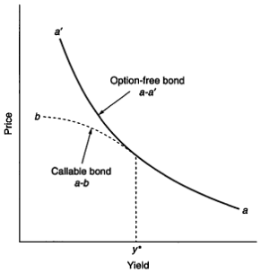

---

CHAPTER 18 Valuation and Price Volatility of Bonds with Embedded Options

321

known, but we do know that there is some level. In Exhibit 18-1, at yield levels below $y^*$ , the price/yield relationship for the callable bond departs from the price/yield relationship for the option-free bond. For example, suppose the market yield were such that an option-free bond was selling for $109. Suppose instead the bond is callable with a call price of $104. Investors would not be willing to pay $109 for this callable bond. If they did and the bond were called, investors would receive $104 (the call price) for a bond they purchased for $109. Notice that for a range of yields below $y^*$ , there is price compression; that is, there is limited price appreciation as yields decline. The portion of the callable bond price/yield relationship below $y^*$ is said to be negatively convex .

Negative convexity means that the price appreciation will be less than the price depreciation for a large change in yield of a given number of basis points. For a bond that is option-free and exhibits positive convexity, the price appreciation will be greater than the price depreciation for a large change in yield. The price changes resulting from bonds exhibiting positive convexity and negative convexity can be expressed as follows:

<table><tr><td rowspan="2">Change in Interest Rates</td><td colspan="2">Absolute Value of Percentage Price Change for</td></tr><tr><td>Positive Convexity</td><td>Negative Convexity</td></tr><tr><td>-100 basis points</td><td>X%</td><td>Less than Y%</td></tr><tr><td>+100 basis points</td><td>Less than X%</td><td>Y%</td></tr></table>

## THE COMPONENTS OF A BOND WITH AN EMBEDDED OPTION

To develop an analytical framework for valuing a bond with an embedded option, it is necessary to decompose a bond into its component pairs. A callable bond, for example, is a bond in which the bondholder has sold the issuer an option (more specifically, a call option) that allows the issuer to repurchase the contractual cash flows of the bond from the time the bond is first callable until the maturity date.

Consider the following two bonds: (1) a callable bond with an 8% coupon, 20 years to maturity, and callable in 5 years at $104 and (2) a 9% coupon, 10-year bond callable immediately at par. For the first bond, the bondholder owns a 5-year optionfree bond and has sold a call option granting the issuer the right to call away from the bondholder 15 years of cash flows 5 years from now for a price of $104. The investor who owns the second bond has a 10-year option-free bond and has sold a call option granting the issuer the right to immediately call the entire 10-year contractual cash flows, or any cash flows remaining at the time the issue is called, for $100.

Effectively, the owner of a callable bond is entering into two separate transactions. First, he buys an option-free bond from the issuer for which he pays some price. Then, he sells the issuer a call option for which he receives the option price. Therefore, we can summarize the position of a callable bondholder

---

322

PART 5 Analyzing Bonds with Embedded Options

as follows:

$$\begin{array} { r l } {  L o n g ~ a ~ c a l l a b l e ~ b o n d  } & {  } \\ { =  L o n g ~ a n o p t i o n - f r e e ~ b o n d  +  S o l d ~ a ~ c a l ~ o p t i o n  . } \end{array}$$

In terms of price, the price of a callable bond is therefore equal to the price of the two components parts. That is,

$$C allable bond price = Option-free bond price -  Call option price.$$

The reason the call option price is subtracted from the price of the optionfree bond is that when the bondholder sells a call option, he receives the option price. Graphically this can be seen in Exhibit 18-1. The difference between the price of the option-free bond and the callable bond at any given yield is the price of the embedded call option.

Actually, the position is more complicated than we just described. The issuer may be entitled to call the bond at the first call date and any time thereafter, or at the first call date and any subsequent coupon anniversary. Thus the investor has effectively sold an American-type call option to the issuer but the call price may vary with the date the call option is exercised. This is because the call schedule for a bond typically has a different call price depending on the call date. Moreover, the underlying bond for the call option is the remaining coupon payments that would have been made by the issuer had the bond not been called. For exposition purposes, it is easier to understand the principles associated with the investment characteristics of callable bonds by describing the investor's position as long as option-free bond and short a call option.

The same logic applies to putable bonds. In the case of a putable bond, the bondholder has the right to sell the bond to the issuer at a designated price and time. A putable bond can be broken into two separate transactions. First, the investor buys an option-free bond. Second, the investor buys an option from the issuer that allows the investor to sell the bond to the issuer. This type of option is called a put option. Therefore, the position of a putable bondholder can be described as

$$\begin{array} { r } {  L o n g ~ a ~ p u t a b l e ~ b o n d  } \\ { =  L o n g ~ a ~ o p t i o n - f r e e ~ b o n d  +  O w n ~ a ~ p u t ~ o p t i o n  . } \end{array}$$

The price of a putable bond is then

$$\begin{array} { r } {  P r i c e \ o f \ a \ p u t a b l e \ b o n d  } \\ { =  O p t i o n - f r e e \ b o n d \ p r i c e + P u t \ o p t i o n \ p r i c e .  } \end{array}$$

## TRADITIONAL VALUATION METHODOLOGY

When a bond is callable, the practice has been to calculate a yield to call as well as a yield to maturity. The former yield calculation assumes that the issuer will call

---

CHAPTER 18 Valuation and Price Volatility of Bonds with Embedded Options

323

the bond at the first call date. As explained in Chapter 7 the procedure for calculating the yield to call is the same as for any yield calculation: determine the interest rate that will make the present value of the expected cash flows equal to the price. In the case of yield to call, the expected cash flows are the coupon payments to the first call date and the call price.

According to the traditional approach, conservative investors should compute the yield to call and yield to maturity for a callable bond selling at a premium, selecting the lower of the two as a measure of potential return. The smaller of the two yield measures should be used to evaluate the relative value of a callable bond. More recently, the traditional approach has been extended to compute not just the yield to the first call date, but the yield to all possible call dates. Since most bonds can be called at any time after the first call date, the approach has been to compute the yield to every coupon anniversary date following the first call date. Then, all the yields to calls calculated and the yield to maturity are compared. The lowest of these yields is called the yield to worst , which is the yield that the traditional approach has investors believing should be used in relative value analysis.

The limitations of the yield to call as a measure of the potential return of a security are given in Chapter 5. The yield to call does consider all three sources of potential return from owning a bond. However, as in the case of the yield to maturity, it assumes that all cash flows can be reinvested at the computed yield—in this case the yield to call—until the assumed call date. Moreover, the yield to call assumes that (1) the investor will hold the bond to the assumed call date, and (2) the issuer will call the bond on that date.

Oftentimes, these underlying assumptions about the yield to call are unrealistic since they do not take into account how an investor will reinvest the proceeds if the issue is called. For example, consider two bonds, M and N. Suppose that the yield to maturity for bond M, a 5-year option-free bond, is 10% while the yield to call for bond N is 10.5% assuming the bond will be called in 3 years. Which bond is better for an investor with a 5-year investment horizon? It is not possible to tell from the yields cited. If the investor intends to hold the bond for 5 years and the issue calls the bond after 3 years, the total dollars that will be available at the end of 5 years will depend on the interest rate that can be earned from investing funds from the call date to the end of the investment horizon.

## LATTICE MODEL FOR VALUING BONDS WITH EMBEDDED OPTIONS $^1$

The discussion in the previous section provides a useful way to conceptualize a bond with an embedded option. Specifically, the value of a callable bond equals the value of a comparable option-free bond less the value of the call option. This insight led

1. This section is adapted from Andrew Kaloty, George O. Williams, and Frank J. Fabozzi, "A Model for the Valuation of Bonds and Embedded Options," Financial Analysis Journal (May-June 1993), pp. 35-46.

---

324

PART 5   Analyzing Bonds with Embedded Options

to the first generation of valuation models for callable bonds. These early models attempted to directly estimate the value of the embedded call option, but without explicitly incorporating the shape of the yield curve.

Instead of relying on an external option pricing model, the lattice model discussed here is based on an internally consistent framework appropriate to bonds with and without embedded options. The difference between the values of a bond with an embedded option and an otherwise identical bond without that option is the value of the option.

As we saw in Chapter 8, instead of discounting all cash flows at the same rate, one should discount each cash flow at its own spot rate. This is equivalent to discounting at a sequence of forward rates. Both the spot rates and the implied forward rates can be calculated by the bootstrapping methodology described in Chapter 8. What was not considered was how expected interest-rate volatility affects spot rates and forward rates and, in turn, how interest-rate volatility affects the value of a bond through its effects on the embedded options.

## Valuation of Option-Free Bonds

We begin with a review of the valuation technique for bonds without any embedded options. The price of an option-free bond is the present value of the cash flows discounted at the spot rates. To illustrate this, we start with the on-the-run yield curve for the particular issuer whose bonds we want to value. The starting point is the Treasury's on-the-run yield curve. To obtain a particular issuer's on-the-run yield curve, an appropriate credit spread is added to each on-the-run Treasury issues. The credit spread need not be constant for all maturities. For example, the credit spreads may increase with maturity.

In our illustration, we use the following hypothetical on-the-run issue for an issuer:

<table><tr><td>Maturity (years)</td><td>Yield to Maturity (%)</td><td>Market Price ($)</td></tr><tr><td>1</td><td>3.50%</td><td>$100</td></tr><tr><td>2</td><td>4.00</td><td>100</td></tr><tr><td>3</td><td>4.50</td><td>100</td></tr></table>

Each bond is trading at par value ($100) so the coupon rate is equal to the yield to maturity. We will simplify the illustration by assuming annual-pay bonds.

Determined by using the bootstrapping methodology, the spot rates are given below:

<table><tr><td>Year</td><td>Spot Rate (%)</td></tr><tr><td>1</td><td>3.500%</td></tr><tr><td>2</td><td>4.010</td></tr><tr><td>3</td><td>4.531</td></tr></table>

---

CHAPTER 18 Valuation and Price Volatility of Bonds with Embedded Options

325

The corresponding 1-year forward rates are

$$\begin{aligned}
&  Current 1-year forward rate =3.500 \% ; \\
&  1-year forward rate 1-year from now =4.523 \% ; \\
&  1-year forward rate 2-years from now =5.580 \% . 
\end{aligned}$$

Now consider an option-free bond with 3 years remaining to maturity and a coupon rate of 5.25%. The value of this bond can be calculated in one of two ways, both producing the same value. First, the coupon payments can be discounted at the zero-coupon rates as shown below:

$$\frac{\$5.25}{(1.035)}+\frac{\$5.25}{(1.040)}+\frac{\$100+\$5.25}{(1.0453)}=\$102.075.$$

The second way is to discount by the 1-year forward rates as shown below:

$$\frac{\$5.25}{(1.035)}+\frac{\$5.25}{(1.035)(1.04525)}+\frac{\$100}{(1.035)(1.04525)(1.0558)}=\$102.075.$$

## Lattice Interest-Rate Tree

Once we allow for embedded options, consideration must be given to interest-rate volatility. This can be done by introducing a lattice interest-rate tree . This tree is nothing more than a graphical depiction of the 1-period forward rates over time based on some assumption about interest-rate volatility. How this tree is constructed is illustrated below. In our presentation in this chapter, we will focus on a specific type of lattice model, the binomial model . In a binomial model, the interest rate can take on only two possible values in the next period. Extension to more than two possible changes in the interest rate in the next period are the same as for the binomial model. $^2$

Exhibit 18-2 shows an example of a binomial interest-rate tree. In this tree, each node (bold circle) represents a time period that is equal to 1 year from the node to its left. Each node is labeled with an N , representing node, and a subscript that indicates the path that 1-year forward rates took to get to that node. L represents the lower of the two 1-year forward rates and H represents the higher of the two 1-year forward rates. For example, node $N_{HH}$ means to get to that node the following path for 1-year forward rates occurred: the 1-year forward rate realized is the higher of the two forward rates in the first year and then the higher of the 1-year forward rates in the second years. $^3$

2. When there are three possible interest rates that can be realized in the next period, the model is referred to as a trinomial model.

3. Note that $N_{HL}$ is equivalent to $N_{LL}$ in the second year. Also, in the third year, $N_{HHL}$ is equivalent to $N_{HLH}$ and $N_{LHH}$ and $N_{HLZ}$ is equivalent to $N_{LLZ}$. We have simply selected one label for a node rather than clutter up the figure with unnecessary information.

---

326

PART 5 Analyzing Bonds with Embedded Options

EXHIBIT 18-2

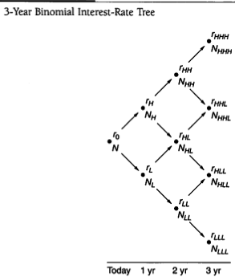

Look first at the point denoted by just N in Exhibit 18-2. This is the root of the tree and is nothing more than the current 1-year rate or, equivalently, the current 1-year forward rate, which we denote by $r_{0}$. What we have assumed in creating this tree is that the 1-year forward rate can take on two possible values: the next period and the two forward rates have the same probability of occurring. One forward rate will be higher than the other. It is assumed that the 1-year forward rate can evolve over time based on a random process called a log-normal random walk with a certain volatility.$^{4}$

We use the following notation to describe the tree in the first year. Let

$\sigma =$ Assumed volatility of the 1-year forward rate; $r_{LL}=$ Lower 1-year forward rate 1 year from now; $r_{HR}=$ Higher 1-year forward rate 1 year from now.

The relationship between $r_{1, L}$ and $r_{1, H}$ is as follows:

$$r _ { 1 , H } = r _ { 1 , L } ( e ^ { 2 \sigma } )$$

where e is the basis of the natural logarithm, 2.71828.

For example, suppose that $r_{1, L}$ is 4.074% and $\sigma$ is 10% per year. Then

$$r_{i, H}=4.074 \%\left(e^{2} \times 10\right)=4.976 \% .$$

4. This is one type of interest-rate model. See Chapter 16 for a discussion of interest-rate models.

---

CHAPTER 18 Valuation and Price Volatility of Bonds with Embedded Options

327

In the second year, there are three possible values for the 1-year forward rate, which we will denote as follows:

$r_{2,LL}=1$ -year forward rate in the second year assuming the lower forward rate in the first year and the lower forward rate in the second year; $r_{2,NH}=1$ -year forward rate in the second year assuming the higher forward rate in the first year and the higher forward rate in the second year; $r_{2,HL}=1$ -year forward rate in the second year assuming the higher forward rate in the first year and the lower forward rate in the second year or, equivalently, the lower forward rate in the first year and the higher forward rate in the second year.

The relationship between $r_{2, L L}$ and the other two forward rates is as follows:

$$r _ { 2 , H H } = r _ { 2 , L L } ( e ^ { 4 \sigma } )$$

$$ and $$

$$r _ { 2 , h l } = r _ { 2 , l l } ( e ^ { 2 \sigma } ) ,$$

So, for example, if $r_{2 L L}$ is 4.53%, and assuming once again that $\sigma$ is 10%, then

$$r _ { 2 H H } = 4 . 5 3 \% \, ( e ^ { 4 } \times 1 0 ) = 6 . 7 5 7 \%$$

$$ and $$

$$r _ { z , h L } = 4 . 5 3 \% ( e ^ { 2 } \times 1 0 ) = 5 . 5 3 2 \% .$$

Exhibit 18-2 shows the notation for the binomial interest-rate tree in the third year. We can simplify the notation by letting $r_1$ be the 1-year forward rate $r$ years from now for the lower forward rate since all the other forward rates $r$ years from now depend on that rate. Exhibit 18-3 shows the interest-rate tree using this simplified notation.

Before we go on to show how to use this binomial interest-rate tree to value bonds, let's focus on two issues here. First, what does the volatility parameter $\sigma$ in the expression $e^{\sigma x}$ represent? Second, how do we find the value of the bond at each node?

## Volatility and the Standard Deviation

It can be shown that the standard deviation of the 1-year forward rate is equal to $r_t \sigma^2$ As will be explained in Chapter 26, the standard deviation is a statistical measure of volatility. In that chapter it will be shown how the standard deviation of interest rates can be estimated. For now it is important to see that the process that we assumed generates the binomial interest-rate tree (or equivalently the forward

5. This can be seen by noting that $e^{2\alpha} = 1 + 2\alpha$. Then the standard deviation of 1-period forward rates is

$$\frac{re^{2}-r}{2}=\frac{r+2\sigma r}{2}=r\sigma.$$

---

328

PART 5 Analyzing Bonds with Embedded Options

EXHIBIT 18-3

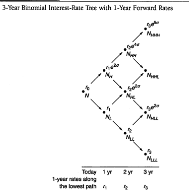

rates) implies that volatility is measured relative to the current level of rates. For example, if $\sigma$ is 10% and the 1-year rate ( $r_{0}$ ) is 4%, then the standard deviation of the 1-year forward rate is 4% $\times$ 10% = 0.4% or 40 basis points. However, if the current 1-year rate is 12%, the standard deviation of the 1-year forward rate would be 12% $\times$ 10% or 120 basis points.

## Determining the Value at a Node

To find the value of the bond at a node, we first calculate the bond's value at the two nodes to the right of the node we are interested in. For example, in Exhibit 18-3, suppose we want to determine the bond's value at node $N_{IR}$ . The bond's value at node $N_{HH}$ and $N'_{HL}$ must be determined. Don't be concerned now with how we get these two values because as we will see the process involves starting from the last year in the tree and working backwards to get the final solution we want, so these two values will be known.

Effectively, what we are saying is that if we are at some node, then the value at that node will depend on the future cash flows. In turn, the future cash flows depend on (1) the bond's value 1 year from now and (2) the coupon payment 1 year from now. The latter is known. The former depends on whether the 1-year forward rate is the higher or lower rate. The bond's value if the rate is higher or lower is reported

---

CHAPTER 18 Valuation and Price Volatility of Bonds with Embedded Options

329

at the two nodes to the right of the node that is the focus of our attention. So, the cash flow at a node will be either (1) the bond's value if the forward rate is the higher rate plus the coupon payments, or (2) the bond's value if the forward rate is the lower rate plus the coupon payment. For example, suppose that we are interested in the bond's value at $N_{H}$ . The cash flow will be either the bond's value at $N_{HH}$ plus the coupon payment or the bond's value at $N_{HL}$ plus the coupon payment.

To get the bond's value at a node we follow the fundamental rule for valuation: the value is the present value of the expected cash flows. The appropriate discount rate to use is the 1-year forward rate at the node. Now there are two present values in this case: the present value if the 1-year forward rate is the higher rate and one if it is the lower rate. Since it is assumed that the probabilities of both outcomes are equal, an average of the two present values is computed. This is illustrated in Exhibit 18-4 for any node assuming that the 1-year forward rate is $\neq$ at the node where the valuation is sought and letting

$V_{H} =$ Bond's value for the higher 1-year forward rate; $V_{L} =$ Bond's value for the lower 1-year forward rate; $C =$ Coupon payment.

Using our notation, the cash flow at a node is either

$$V_{H}+C  for the higher 1-year forward rate$$

or

$$V_{L}+C  for the lower 1-year forward rate.$$

## $$  EXHIBIT 18-4  $$

Calculating a Value at a Node

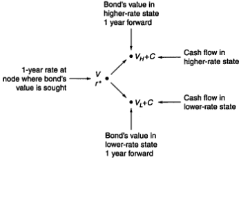

---

330

PART 5 Analyzing Bonds with Embedded Options

The present value of these two cash flows using the 1-year forward rate at the time, $t^{*}$, is

$$\frac{V_{H}+U}{(1+r)^{2}}= Present value for the higher 1-year forward rate;$$

$$\frac{V_{L}+C}{(1+r)^{r}}=\text{Present value for the lower 1-year forward rate.}$$

Then, the value of the bond at the node is found as follows:

$$Value at a node =\frac{1}{2}\left[\frac{V_{u}+C}{(1+r)^{2}}-\frac{V_{u}+C}{(1+r)^{2}}\right]$$

## Constructing the Binomial Interest-Rate Tree

To see how to construct the binomial interest-rate tree, let's use the assumed onthe-run yields we used earlier. We will assume that volatility, $\sigma$ , is 10% and construct a 2-year tree using the 2-year bond with a coupon rate of 4%.

Exhibit 18-5 shows a more detailed binomial interest-rate tree with the cash flow shown at each node. We'll see how all the values reported in the exhibit are obtained. The root rate for the tree, $r_{0}$ , is simply the current 1-year rate, 3.5 % .

In the first year there are two possible 1-year forward rates, the higher forward rate and the lower forward rate. What we want to find are the two forward rates that will be consistent with the volatility assumption, the process that is assumed to generate the forward rates, and the observed market value of the bond. There is no simple formula for this. It must be found by an iterative process (i.e., trial and error). The steps are described and illustrated below.

Step 1: Select a value for $r_{L}$. Recall that $r_{L}$ is the lower 1-year forward rate. In this first trial, we arbitrarily selected a value of 4.5%.

Step 2: Determine the corresponding value for the higher 1-year forward rate. As explained earlier, this rate is related to the lower 1-year forward rate as follows: $r_{f}e^{20}$. Since $r_{I}$ is 4.5%, the higher 1-year forward rate is 5.496% (= 4.5% $e^{2×10}$). This value is reported in Exhibit 18-5 at note $N_{H}$.

Step 3: Compute the bond value's 1 year from now. This value is determined as follows:

3a. Determine the bond's value 2 years from now. In our example, this is simple. Since we are using a 2-year bond, the bond's value is its maturity value ($100) plus its final coupon payment ($4). Thus, it is $104.

3b. Calculate the present value of the bond's value found in Step 3a for the higher forward rate in the second year. The appropriate

---

CHAPTER 18 Valuation and Price Volatility of Bonds with Embedded Options

331

EXHIBIT 18-5

Find the 1-Year Forward Rates for Year 1 by Using the 2-Year, 4% On-the-Run Issue: First Trial

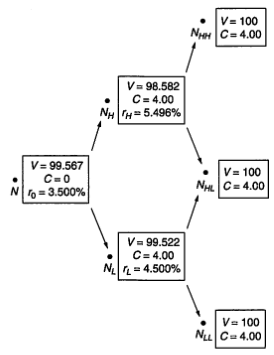

discount rate is the higher 1-year forward rate, 5.496% in our example. The present value is $98.582 (= $104/1.05496). This is the value of $V_{H}$ that we referred to earlier.

3c. Calculate the present value of the bond's value assumed in Step 3a for the lower forward rate. The discount rate assumed for the lower 1-year forward rate is 4.5%. The present value is $99,522 (= $104/1.045) and is the value of $V_L$ .

3d. Add the coupon to both $V_{H}$ and $V_{T}$ to get the cash flow at $N_{H}$ and $N_{L}$, respectively. In our example we have $102.582$ for the higher forward rate and $103.522$ for the lower forward rate.

3e. Calculate the present value of the two values using the 1-year forward rate r*. At this point in the valuation, r* is the root rate, 3.50%.

Therefore,

$${\frac {V_{L}+C}{1+r^{2}}}=$$ ${\frac {\$02,582}{1.035}}$ $=$ $99,113$$

---

332

PART 5 Analyzing Bonds with Embedded Options

$$ and $$

$$V_{c}+C=\frac{\$03,522}{1+r^{\prime}}=\frac{\$100,021}{1035}$$

Step 4: Calculate the average present value of the two cash flows in Step 3.

This is the value we referred to earlier as

$$Value\ at\ a\ node=\frac{1}{2}\left(\frac{V_{L}+C}{(I+r)}+\frac{V_{L}+C}{(I+r)}\right)$$

In our example, we have

$$Value at a node =\frac{1}{2}[99.113+100.021]=$99.567$$

Step 5: Compare the value in Step 4 to the bond's market value. If the two values are the same, then the $r_t$ used in this trial is the one we seek.

This is the 1-year forward rate that would then be used in the binomial interest-rate tree for the lower forward rate and the corresponding higher forward rate. If, instead, the value found in Step 4 is not equal to the market value of the bond, this means that the value $r_t$ in this trial is not the 1-year forward rate that is consistent with (1) the volatility assumption of 10 % , (2) the process assumed to generate the 1-year forward rate, and (3) the observed market value of the bond. In this case, the five steps are repeated with a different value for $r_t$ .

When $r_1$ is 4.5%, a value of $99.567$ results in Step 4, which is less than the observed market price of $100. Therefore, 4.5% is too large and the five steps must be repeated, trying a lower rate for $r_1$ .

Let's jump right to the correct rate for $r_1$ in this example and rework Steps 1 through 5. This occurs when $r_1$ is 4.074 % . The corresponding binomial interest rate is shown in Exhibit 18-6.

Step 1: In this trial we select a value of 4.074% for $r_1$, the lower 1-year forward rate.

Step 2: The corresponding value for the higher 1-year forward rate is 4.976% (= 4.074 % e^ { x/10 } ).

Step 3: The bond's value 1 year from now is determined as follows:

- 3a. The bond's value 2 years from now is $104, just as in the first
trial.
3b. The present value of the bond's value found in Step 3a for the
higher 1-year forward rate, $V_{rt}$, is $99,071 (= $104/1.04976).
3c. The present value of the bond's value found in Step 3a for the
lower 1-year forward rate, $V_{rt}$, is $99,929 (= $104/1.04074).
---

CHAPTER 18 Valuation and Price Volatility of Bonds with Embedded Options

333

EXHIBIT 18-6

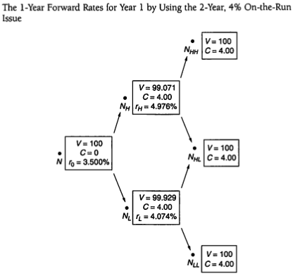

3d. Adding the coupon to $V_H$ and $V_L$ , we get $103.071 as the cash flow for the higher forward rate and $103.929 as the cash flow for the lower forward rate.

3e. The present value of the two cash flows using the 1-year forward rate at the node to the left, 3.5%, gives

$$V _ { t } + C \left( 1 + r \right) = \frac { 1 0 3 . 0 7 1 } { 1 . 0 3 5 } = \$ 9 9 . 5 8 6$$

and

$$\frac{V_{t}+C}{1+r^{*}}=\frac{\$ 103,929}{1,035}=\$ 100414 .$$

Step 4: The average present value is $100, which is the value at the node.

Step 5: Since the average present value is equal to the observed market price of $100, r_{1}$ or $r_{1}$ is 4.074% and $r_{1}$ is 4.976%.

---

334

PART 5   Analyzing Bonds with Embedded Options

We're not done. Suppose that we want to "grow" this tree for one more year—that is, we want to determine $r_2$ . Now we will use the 3-year-on-the-run issue, the 4.5% coupon bond, to get $r_2$ . The same five steps are used in an iterative process to find the 1-year-forward rates in the tree 2 years from now. Our objective is now to find the value of $r_2$ that will produce a bond value of $100$ (since the 3-year onthe-run issue has a market price of $100) and is consistent with (1) a volatility assumption of 10%, (2) a current 1-year forward rate of 3.5%, and (3) the two forward rates: 1-year from now of 4.074% (the lower forward rate) and 4.976% (the higher forward rate).

We explain how this is done using Exhibit 18-7. Let's look at how we get the information in the exhibit. The maturity value and coupon payment 3 years from

$$ EXXIBIT 18-7 $$

Information for Deriving the 1-Year Forward Rates for Year 2 by Using the 3-Year, 4.5% On-the-Run Issue

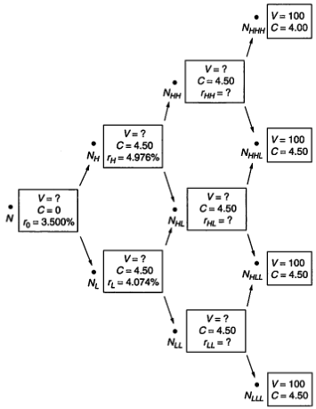

---

CHAPTER 18 Valuation and Price Volatility of Bonds with Embedded Options

335

now are shown in the boxes at the four nodes. Since the 3-year on-the-run issue has a maturity value of $100 and a coupon payment of $4.5, these values are the same in the box shown at each node. For the three nodes 2 years from now the coupon payment of $4.5 is shown. Unknown at these three nodes are (1) the three forward rates 2 years from now and (2) the value of the bond 2 years from now. For the two nodes 1 year from now, the coupon payment is known, as are the 1-year forward rates 1 year from now. These are the forward rates found earlier. The value of the bond, which depends on the bond values at the nodes to the right, are unknown at these two nodes.

Exhibit 18-8 is the same as Exhibit 18-7 complete with the values previously unknown. As can be seen from Exhibit 18-8, the value of $r_{2}$ or, equivalently, $r_{2JJ}$,

$$ EXHIBIT 18-8 $$

The 1-Year Forward Rates for Year 2 by Using the 3-Year, 4.5% On-the-Run

Issue

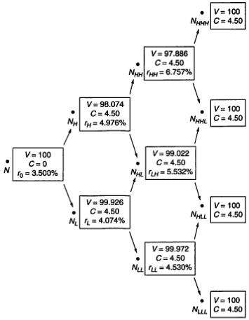

---

336

PART 5 Analyzing Bonds with Embedded Options

which will produce the desired result is 4.53 % . We showed earlier that the corresponding forward rates $r_{IHL}$ and $r_{JHL}$ would be 5.532 % and 6.757 % , respectively. To verify that these are the 1-year forward rates 2 years from now, work backwards from the four nodes at the right of the tree in Exhibit 18-8. For example, the value in the box at $N_{IHL}$ is found by taking the value of $104.5$ at the two nodes to its right and discounting at 6.757 % . The value is $98.886$ . (Since it is the same value for both nodes to the right, it is also the average value.) Similarly, the value in the box at $N_{HL}$ is found by discounting $104.50$ by 5.532 % and at $N_{UL}$ by discounting at 4.53 % . The same procedure used in Exhibits 18-5 and 18-6 is used to get the values at the other nodes.

## Valuing an Option-Free Bond

Exhibit 18-9 shows the 1-year forward rates or binomial interest-rate tree that can then be used to value any 1-year, 2-year, or 3-year bond for this issuer. To illustrate how to use the binomial interest-rate tree, consider a 5.25% option-free bond of this issuer with 3 years remaining to maturity. Also assume that the issuer's onthe-run yield curve is the one given earlier and hence the appropriate binomial interest-rate tree is the one in Exhibit 18-9. Exhibit 18-10 shows the various values in the discounting process and produces a bond value of $102,075.

It is important to note that this value is identical to the bond value found earlier when we discounted at either the spot rates or the 1-year forward rates. We should expect to find this result since our bond is option-free. This clearly demonstrates that the valuation model is consistent with the standard valuation model for an option-free bond.

EXHIBIT 18-9

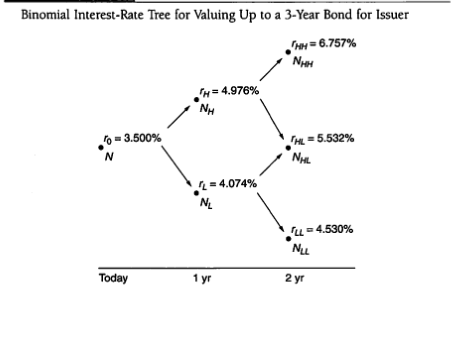

---

CHAPTER 18 Valuation and Price Volatility of Bonds with Embedded Options

337

EXHIBIT 18-10

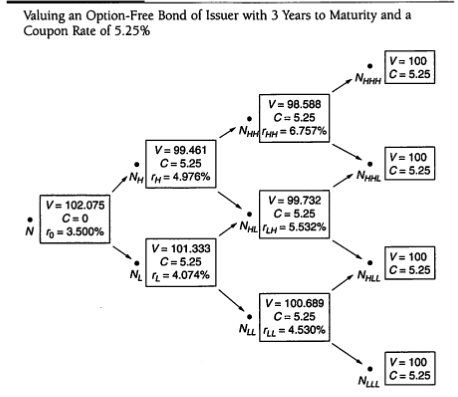

## Valuing a Callable Bond

Now we will demonstrate how the binomial interest-rate tree can be applied to value a callable bond. The valuation process proceeds in the same fashion as in the case of an option-free bond, but with one exception: when the call option may be exercised by the issuer, the bond value at a node must be changed to reflect the lesser of its value if it is not called (i.e., the value obtained by applying the recursive valuation formula described above) and the call price.

For example, consider a 5.25% bond with 3 years remaining to maturity that is callable in 1 year at $100. To simplify the illustration, let's assume the issuer will call the bond if its price exceeds $100. Exhibit 18–11 shows the values at each node of the binomial interest-rate tree. The discounting process is identical to that shown in Exhibit 18–10 except that at two nodes $N_{LL}$ and $N_{LL}$ the values from the recursive valuation formula ($101.002 at $N_{L}$ and $100.689 at $N_{LL}$) exceed the call price ($100) and therefore have been struck out and replaced with $100. Each time a value derived from the recursive valuation formula has been replaced, the process for finding the values at that node is reworked starting with the period to the right. The value for this callable bond is $101.432.

---

338

PART 5 Analyzing Bonds with Embedded Options

$$ EXHIBIT 18-11 $$

Valuing a Callable Bond with 3 Years to Maturity, a Coupon Rate of 5.25%, and Callable in 1 Year at $100*

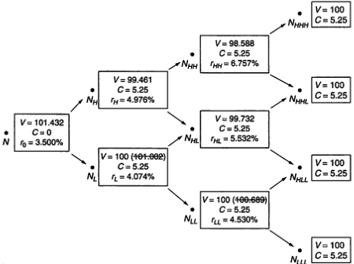

*Bond assumed to be called if value exceeds $100.

The question that we have not addressed in our illustration, but which is nonetheless important, is under which circumstances the issuer will call the bond. A detailed explanation of the call rule is beyond the scope of this chapter. Basically, it involves determining when it is economic for the issuer on an after-tax basis to call the issue.

Since the value of a callable bond is equal to the value of an option-free bond minus the value of the call option, this means that

$$\begin{aligned}
&  Value of the call option  \\
&  = Value of the option-free bond -  Value of the callable bond. 
\end{aligned}$$

But we have just seen how the value of an option-free bond and the value of a callable bond can be determined. The difference between the two values is therefore the value of the call option.

In our illustration, since the value of the option-free bond is $102.075 and the value of the callable bond is $101.432, the value of the call option is $0.643.

Extension to Other Embedded Options

The bond valuation framework presented here can be used to analyze other embedded options such as put options, caps and floors on floating-rate notes, step-up notes,

---

CHAPTER 18 Valuation and Price Volatility of Bonds with Embedded Options

339

EXHIBIT 18-12

Valuing a Putable Bond with 3 Years to Maturity, a Coupon Rate of 5.25%, and Putable in 1 Year at $100*

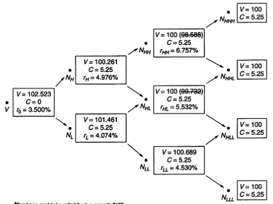

*Bond assumed to be called if value exceeds $100.

range notes, and the optional accelerated redemption granted to an issuer in fulfilling its sinking-fund requirement. $^6$ For example, let's consider a putable bond. Suppose that a 5.25 % bond with 3 years remaining to maturity is putable in 1 year at par ( $\$100$ ). Also assume that the appropriate binomial interest-rate tree for this issuer is the one in Exhibit 18-9. Exhibit 18-12 shows the binomial interest-rate tree with the bond values altered at two nodes ( $N_{HHH}$ and $N_{HJ}$ ) because the bond values at these two nodes falls below $\$100$ , the assumed value at which the bond can be put. The value of this putable bond is $\$0.102,523$ .

Since the value of an option-free bond can be expressed as the value of a putable bond minus the value of a put option on that bond, this means that

$$ Value of the put option $$

$$= Value of the option-free bond - Value of the putable bond.$$

6. The valuation of floating-rate notes with embedded options, floating-rate notes with caps and/or floors, range notes, and step-up notes using the binomial model are presented in Michael Dorigan, Frank J. Fabozzi, and Andrew Kalotay, "Valuating of Floating-Rate Bonds," in Frank J. Fabozzi (ed.), Professional Perspectives on Fixed Income Portfolio Management: Volume 2 (Hoboken, NJ: John Wiley & Sons, 2000), pp. 193-212.

---

340

PART 5 Analyzing Bonds with Embedded Options

In our example, since the value of the putable bond is $102.523 and the value of the corresponding option-free bond is $102.075, the value of the put option is -$0.448. The negative sign indicates the issuer has sold the option or, equivalently, the investor has purchased the option.

The framework can also be used to value a bond with multiple or interrelated embedded options. The bond values at each node are altered based on whether one of the options is exercised.

### Interest-Rate Volatility and the Theoretical Value

In our illustration, interest-rate volatility was assumed to be 10 % . The volatility assumption has an important impact on the theoretical value. More specifically, the higher the expected volatility, the higher the value of an option. The same is true for an option embedded in a bond. Correspondingly, this affects the value of the bond with an embedded option.

For example, for a callable bond, a higher interest-rate volatility assumption means that the value of the call option increases and, since the value of the optionfree bond is not affected, the value of the callable bond must be lower. For a putable bond, higher interest-rate volatility means that its value will be higher.

## OPTION-ADJUSTED SPREAD

The valuation model gives the theoretical value of a bond. For example, if the observed price of the 3-year, 5.25% callable bond is $101 and the theoretical value is $101.432, this means that this bond is cheap by $0.432 according to the valuation model. Bond market participants, however, prefer to think not in terms of a bond's price being cheap or expensive in dollar terms but rather in terms of a yield spread—a cheap bond trades at a higher yield spread and an expensive bond at a lower yield spread.

The market convention is to think of a yield spread as the difference between the yield to maturity on a particular bond and the yield on a comparable maturity Treasury. However, this is inappropriate because, as we have explained, there is not one rate at which all cash flows should be discounted but a set of spot rates or, equivalently, forward rates. Given that this is the correct procedure for discounting, market participants determine the spread over the issuer's spot rate curve or forward rates. In terms of our binomial interest-rate tree, it is the constant spread that when added to all the forward rates on the tree will make the theoretical value equal to the market price. The constant spread that satisfies this condition is called the option-adjusted spread (OAS). The spread is referred to as an “option-adjusted” spread since the spread takes into consideration the option embedded in the issue.

Returning to our illustration, if the observed market price is $101, the OAS would be the constant spread added to every forward rate in Exhibit 18-9 that will make the theoretical value equal to $101. In this case, that spread is 23.2 basis points, as can be verified in Exhibit 18-13.

---

CHAPTER 18 Valuation and Price Volatility of Bonds with Embedded Options

341

EXHIBIT 18-13

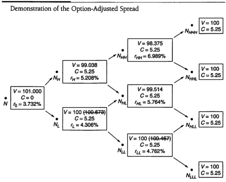

As with the value of a bond with an embedded option, the OAS will depend on the volatility assumption. For a given bond price, the higher the interest-rate volatility assumed, the lower the OAS for a callable bond and the higher the OAS for a puttable bond.

The interpretation of the OAS depends on the benchmark on-the-run issue used in the mode. For example, some dealers use the Treasury on-the-run to generate the binomial tree. In this case, the OAS captures the credit spread, a liquidity premium, and any richness or cheapness of the bond being valued after adjusted for the embedded option. In contrast, some dealers use the issuer's on-the-run issue to construct the binomial tree and, as a result, the spread has already accounted for the credit risk. Thus, the OAS reflects a liquidity premium and the richness or cheapness of the issue after considering the embedded option.

It is critical to understand that OAS is not a valuation model. Rather, it is a product of a valuation model. If the valuation model is poor, the OAS will be meaningless.

## PRICE VOLATILITY OF BONDS WITH EMBEDDED OPTIONS

In Chapter 12 the price volatility characteristics of option-free bonds were explained. In Chapter 13, duration was introduced as a measure of interest-rate risk. More

---

342

PART 5 Analyzing Bonds with Embedded Options

specifically, the concept of modified duration was explained. Modified duration is a measure of the sensitivity of a bond's price to interest-rate changes, assuming that the expected cash flow does not change with interest rates. Consequently, modified duration may not be an appropriate measure for bonds with embedded options because the expected cash flows change as interest rates change. For example, when interest rates fall, the binomial tree changes resulting in a change in the expected cash flow for a bond with an embedded option.

While modified duration may be inappropriate as a measure of a bond's price sensitivity to interest-rate changes, there is a duration measure that is more appropriate for bonds with embedded options. Since duration measures price responsiveness to changes in interest rates, the duration for a bond with an embedded option can be estimated by letting interest rates change by a small number of basis points above and below the prevailing yield, and seeing how the prices change. As explained and illustrated in Chapter 13, the duration for any bond can be approximated as follows:

$$Approximate\  duration ={\frac {V_{c}-V_{a}}{2V_{0}(\Delta y)}}$$

where

$V_{0}=$ Initial value or price of the security;

$V_{s}=$ Estimated value of the security if the yield is decreased by $\Delta y$;

$V_{i}=$ Estimated value of the security if the yield is increased by $\Delta y$;

$\Delta y$ = Change in the yield of a security.

## Effective Duration

Application of this formula to an option-free bond gives the modified duration because the cash flows do not change when yields change. When the approximate duration formula is applied to a bond with a embedded option, the new prices at the higher and lower yield levels should reflect the change in the cash flow. Duration calculated in this way is called effective duration or option-adjusted duration.

Exhibit 18-14 summarizes the distinction between modified duration and effective duration.

The difference between modified duration and effective duration for fixedincome securities with an embedded option can be quite dramatic. For example, a callable bond could have a modified duration of 4 but an effective duration of only 2. For certain mortgage-backed securities, the modified duration could be 7 and the effective duration 40! Thus, using modified duration as a measure of the price sensitivity of a security to a parallel shift in the yield curve would be misleading. The more appropriate measure for any security with an embedded option is effective duration.

### Calculating the Effective Duration by Using the Binomial Model

The procedure for calculating the values must be substituted into the duration formula by using the binomial model is described below. First, V, is determined as follows:

---

CHAPTER 18 Valuation and Price Volatility of Bonds with Embedded Options

343

### $$  EXXIBIT 18-14  $$

Modified Duration versus Effective Duration

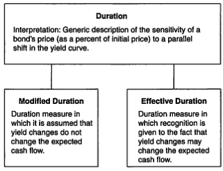

Step 1 Calculate the option-adjusted spread (OAS) for the issue.

Step 2 Shift the on-the-run yield curve up by a small number of basis points.

Step 3 Construct a binomial interest-rate tree based on the new yield curve in Step 2.

Step 4. Add the OAS to each of the forward rates in the binomial interestrate tree to obtain an "adjusted tree."

Step 5 Use the adjusted tree found in Step 4 to determine the value of the security, which is $V_{*}$.

To determine the value of $V_c$ , the same five steps are followed except that in Step 2, the on-the-run yield curve is shifted down by a small number of basis points.

Let's return to the example of the callable 5.25% 3-year bond. Given the yield curve and volatility assumptions we have been using, $V_{o}$ is $101.432. Following the five steps above for a shift of the yield curve by 10 basis points down and up gives values for $V_{o}$ and $V_{*}$ of $101.628$ and $101.234$, respectively. The effective duration is then

$$Effective\ duration= \frac{101.628-101.234}{(2(101.432)(0.001)}=1.94.$$

## Effective Convexity

In the same manner, the standard convexity measure explained in Chapter 14 may be inappropriate for a bond with embedded options because it does not consider

---

344

PART 5 Analyzing Bonds with Embedded Options

the effect of a change in interest rates on the bond's cash flow. The convexity of any bond can be approximated using the following formula:

$$Convexity=\frac{V_{x}+V_{y}-2V_{0}}{V_{0}(d\Delta y)^{2}}$$

The values in the formula are the same values used in the duration formula.

When the prices used in this formula assume that the cash flows do not change when yields change, the resulting convexity is a good approximation of the standard convexity for an option-free bond. When the prices used in the formula are derived by changing the cash flows when yields change, the resulting convexity is called effective convexity or option-adjusted convexity . In our illustration, the effective convexity is

$$Effective\ convexity=\frac{\ $101.628+\$101.234-2(101.432)}{(101.432)(0.001)^{2}}=6.77$$

## SUMMARY

In this chapter a valuation framework that can be used to value any bond is explained. It involves generating a lattice interest-rate tree based on (1) an issuer's on-the-run yield curve, (2) an assumed interest-rate generation process, and (3) an assumed interest-rate volatility. The lattice interest-rate tree provides the appropriate volatility-dependent 1-period forward rates that should be used to discount the expected cash flows of a bond. The value of the embedded option is the difference between the value of an option-free bond and the value of the bond with the embedded option. In our illustrations, we used a special type of lattice model, the binomial model. In this model, the interest rate can take on only two possible values in the next period.

The option-adjusted spread is the constant spread that when added to the forward rates in the binomial interest-rate tree will produce a valuation for the bond equal to the market price of the bond. It is simply a way of recasting the difference between the theoretical value and the observed market price in terms of a yield spread.

Modified duration and standard convexity used to measure the interest-rate sensitivity of an option-free bond may be inappropriate for a bond with an embedded option because these measures assume that cash flows do not change as interest rates change. The duration and convexity can be approximated for any bond whether it is option-free or has an embedded option. The approximation involves determining how the price of the bond changes if interest rates go up or down by a small number of basis points. If when interest rates are changed it is assumed that the cash flows do not change, then the resulting measures are modified duration and standard convexity. However, when the cash flows are allowed to change when interest rates change, the resulting measures are called effective duration and effective convexity.

