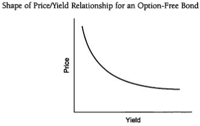
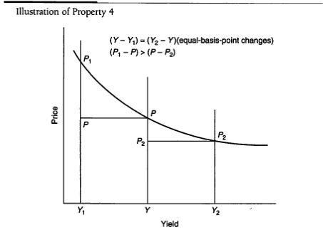
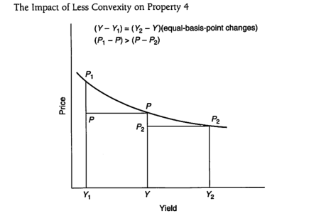
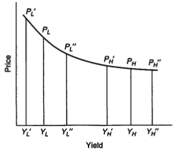
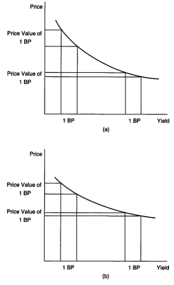

## CHAPTER TWELVE  PRICE VOLATILITY OF PROPERTIES OF OPTION-FREE BONDS

To implement effective portfolio trading and risk-control strategies, it is necessary to understand the price volatility characteristics of bonds. Chapters 12–15 in this section of the book focus on bond price volatility. In this chapter, general price volatility properties of option-free bonds are discussed, as well as bond characteristics that determine price volatility. At the end of this chapter we discuss one way to measure a bond's price volatility.

### A CLOSER LOOK AT THE PRICE/YIELD RELATIONSHIP FOR OPTION-FREE BONDS

In Chapter 6 we demonstrated a fundamental principle of all option-free bonds (a bond that does not have an embedded option): the price of a bond changes in the opposite direction of the change in the required yield for the bond . This principle follows from the fact that the price of an option-free bond is equal to the present value of its expected cash flows. An increase (decrease) in the required return decreases (increases) the present value of its expected cash flows, and therefore, the bond's price.

Exhibit 12–1 illustrates this property for 12 hypothetical bonds: three bonds with the same coupon rate but different maturities (5, 15, and 30 years), and four bonds with the same maturity but different coupon rates (0%, 8%, 10%, and 14%). These 12 bonds are used in this and the following three chapters to demonstrate the bond price volatility of option-free bonds and measures of bond price volatility.

For each bond in Exhibit 12-1 the price of the bond (with par equal to 100) is shown for 13 yield levels. The top panel shows the price for yield levels from 10% to 13%; the bottom panel, the price for yield levels from 7% to 10% is shown.

If the price/yield relationship for any of the 12 bonds in Exhibit 12-1 is graphed, the shape of the graph would be as shown in Exhibit 12-2. As the required yield rises, the price of the option-free bond declines. However, the relationship is not linear (that is, it is not a straight line). The price/yield relationship for all optionfree bonds takes this nonlinear shape, referred to as convex .

193

---

$$ EXHIBIT $$

Price/Yield Relationship for 12 Hypothetical Bonds

<table><tr><td rowspan="2">Coupon (%)</td><td rowspan="2">Term (years)</td><td colspan="7">Yield Level</td></tr><tr><td>10.00%</td><td>10.01%</td><td>10.10%</td><td>10.50%</td><td>11.00%</td><td>12.00%</td><td>13.00%</td></tr><tr><td>0.00%</td><td>5</td><td>$61.39</td><td>$61.36</td><td>$61.10</td><td>$69.95</td><td>$58.54</td><td>$55.84</td><td>$53.27</td></tr><tr><td>0.00</td><td>15</td><td>23.14</td><td>23.10</td><td>22.81</td><td>21.54</td><td>20.06</td><td>17.41</td><td>15.12</td></tr><tr><td>0.00</td><td>30</td><td>5.35</td><td>5.34</td><td>5.20</td><td>4.64</td><td>4.03</td><td>3.03</td><td>2.29</td></tr><tr><td>8.00</td><td>5</td><td>92.28</td><td>92.24</td><td>91.91</td><td>90.46</td><td>88.69</td><td>85.28</td><td>82.03</td></tr><tr><td>8.00</td><td>15</td><td>84.63</td><td>84.56</td><td>83.95</td><td>81.32</td><td>78.20</td><td>72.47</td><td>67.35</td></tr><tr><td>8.00</td><td>30</td><td>81.07</td><td>80.99</td><td>80.29</td><td>77.30</td><td>73.83</td><td>67.68</td><td>62.42</td></tr><tr><td>10.00</td><td>5</td><td>100.00</td><td>99.96</td><td>99.61</td><td>98.09</td><td>96.23</td><td>92.64</td><td>89.22</td></tr><tr><td>10.00</td><td>15</td><td>100.00</td><td>99.92</td><td>99.24</td><td>96.26</td><td>92.73</td><td>86.24</td><td>80.41</td></tr><tr><td>10.00</td><td>30</td><td>100.00</td><td>99.91</td><td>99.06</td><td>95.46</td><td>91.28</td><td>83.84</td><td>77.45</td></tr><tr><td>14.00</td><td>5</td><td>115.44</td><td>115.40</td><td>115.02</td><td>113.35</td><td>111.31</td><td>107.36</td><td>103.59</td></tr><tr><td>14.00</td><td>15</td><td>130.74</td><td>130.65</td><td>129.81</td><td>126.15</td><td>121.80</td><td>113.76</td><td>106.53</td></tr><tr><td>14.00</td><td>30</td><td>137.86</td><td>137.73</td><td>136.60</td><td>131.79</td><td>126.17</td><td>116.18</td><td>107.62</td></tr></table>

194

---

<table><tr><td>Coupon (%)</td><td>Term (years)</td><td>10.00%</td><td>9.99%</td><td>9.90%</td><td>9.50%</td><td>9.00%</td><td>8.00%</td><td>7.00%</td></tr><tr><td>0.00%</td><td>5</td><td>$61.39</td><td>$61.42</td><td>$61.68</td><td>$62.87</td><td>$64.39</td><td>$67.56</td><td>$70.89</td></tr><tr><td>0.00</td><td>15</td><td>23.14</td><td>23.17</td><td>23.47</td><td>24.85</td><td>26.70</td><td>30.83</td><td>35.63</td></tr><tr><td>0.00</td><td>30</td><td>5.35</td><td>5.37</td><td>5.51</td><td>6.18</td><td>7.13</td><td>9.51</td><td>12.69</td></tr><tr><td>8.00</td><td>5</td><td>92.28</td><td>92.32</td><td>92.65</td><td>94.14</td><td>96.04</td><td>100.00</td><td>104.16</td></tr><tr><td>8.00</td><td>15</td><td>84.63</td><td>84.70</td><td>85.31</td><td>88.13</td><td>91.86</td><td>100.00</td><td>109.20</td></tr><tr><td>8.00</td><td>30</td><td>81.07</td><td>81.15</td><td>81.87</td><td>85.19</td><td>89.68</td><td>100.00</td><td>112.47</td></tr><tr><td>10.00</td><td>5</td><td>100.00</td><td>100.04</td><td>100.39</td><td>101.95</td><td>103.96</td><td>108.11</td><td>112.47</td></tr><tr><td>10.00</td><td>15</td><td>100.00</td><td>100.08</td><td>100.77</td><td>103.96</td><td>108.14</td><td>117.29</td><td>127.57</td></tr><tr><td>10.00</td><td>30</td><td>100.00</td><td>100.09</td><td>100.95</td><td>104.94</td><td>110.32</td><td>122.62</td><td>137.42</td></tr><tr><td>14.00</td><td>5</td><td>115.44</td><td>115.49</td><td>115.87</td><td>117.59</td><td>119.78</td><td>124.33</td><td>129.11</td></tr><tr><td>14.00</td><td>15</td><td>130.74</td><td>130.84</td><td>131.69</td><td>135.60</td><td>140.72</td><td>151.88</td><td>164.37</td></tr><tr><td>14.00</td><td>30</td><td>137.86</td><td>137.99</td><td>139.13</td><td>144.44</td><td>151.60</td><td>167.87</td><td>187.31</td></tr></table>

195

---

196

PART 4 Price Volatility for Option-Free Bonds

EXHIBIT 12-2

While all option-free bonds will have the convex shape shown in Exhibit 12–2, the curvature of every option-free bond will be different. As we will see in this chapter and the following three, it is this convex shape that holds the key to assessing the performance of a bond and a portfolio of bonds.

It is important to keep in mind that the price/yield relationship that we have discussed refers to an instantaneous change in the yield. As we explained in Chapter 3 , assuming no change in the perceived credit risk of the issuer as a bond moves toward maturity, there are two factors that influence the price of any optionfree bond. First, the bond's price will change as the required yield changes, as we know. Second, for discount and premium bonds the bond's price will change even if yields remain the same. In particular, the price of a discount bond will increase as it moves toward maturity, reaching par value at the maturity date; for a premium bond, the bond's price will decrease as it moves closer to maturity, finally declining to the par value at the maturity date.

## THE PRICE VOLATILITY CHARACTERISTICS OF OPTION-FREE BONDS

To investigate bond price volatility in terms of percentage price change, let's assume that the prevailing yield in the market is 10% for all 12 bonds. The dollar price change per $100 of par value for various changes in yield is shown in Exhibit 12-3. Exhibit 12-4 shows the corresponding percentage change in each bond's price. The percentage price change shown in Exhibit 12-4 is found by dividing the dollar price change in Exhibit 12-3 by the price of the bond at a 10% yield, as shown in Exhibit 12-1.

For example, consider the 8%, 15-year bond. The price for this bond if the required yield is 10% is $84.63. If the required yield increases 100 basis points to 11%, the price of this bond would fall to $78.20. The dollar price change per $100

---

$$ EXXIBIT 12-3 $$

Dollar Price Change per $100 of Par Value as Yield Changes for 12 Hypothetical Bonds

<table><tr><td rowspan="3"></td><td rowspan="3">Term (years)</td><td colspan="6">Change in Basis Points from 10%</td></tr><tr><td>1</td><td>10</td><td>50</td><td>100</td><td>200</td><td>300</td></tr><tr><td colspan="6">New Yield Level</td></tr><tr><td>Coupon (%)</td><td>5</td><td>$-0.03</td><td>$-0.26</td><td>$-1.15</td><td>$-1.41</td><td>$-2.70</td><td>$-2.57</td></tr><tr><td>0.00%</td><td>15</td><td>-0.03</td><td>-0.33</td><td>-1.59</td><td>-3.07</td><td>-5.73</td><td>-8.02</td></tr><tr><td>0.00</td><td>30</td><td>-0.02</td><td>-0.15</td><td>-0.71</td><td>-1.33</td><td>-2.32</td><td>-3.07</td></tr><tr><td>8.00</td><td>5</td><td>-0.04</td><td>-0.37</td><td>-1.81</td><td>-3.58</td><td>-7.00</td><td>-10.25</td></tr><tr><td>8.00</td><td>15</td><td>-0.07</td><td>-0.68</td><td>-3.31</td><td>-6.43</td><td>-12.16</td><td>-17.27</td></tr><tr><td>8.00</td><td>30</td><td>-0.08</td><td>-0.78</td><td>-3.78</td><td>-7.25</td><td>-13.39</td><td>-18.65</td></tr><tr><td>10.00</td><td>5</td><td>-0.04</td><td>-0.39</td><td>-1.91</td><td>-3.77</td><td>-7.36</td><td>-10.78</td></tr><tr><td>10.00</td><td>15</td><td>-0.08</td><td>-0.76</td><td>-3.74</td><td>-7.27</td><td>-13.76</td><td>-19.59</td></tr><tr><td>10.00</td><td>30</td><td>-0.09</td><td>-0.94</td><td>-4.54</td><td>-8.72</td><td>-16.16</td><td>-22.55</td></tr><tr><td>14.00</td><td>5</td><td>-0.04</td><td>-0.42</td><td>-2.09</td><td>-4.14</td><td>-8.08</td><td>-11.85</td></tr><tr><td>14.00</td><td>15</td><td>-0.09</td><td>-0.94</td><td>-4.59</td><td>-8.94</td><td>-16.98</td><td>-24.22</td></tr><tr><td>14.00</td><td>30</td><td>-0.13</td><td>-1.25</td><td>-6.07</td><td>-11.68</td><td>-21.70</td><td>-30.34</td></tr></table>

1

---

EXHIBIT 12-3 Dollar Price Change per $100 of Par Value as Yield Changes for 12 Hypothetical Bonds (Continued)

<table><tr><td rowspan="3"></td><td rowspan="3"></td><td colspan="6">Change in Basis Points from 10%</td></tr><tr><td>-1</td><td>-10</td><td>-50</td><td>-100</td><td>-200</td><td>-300</td></tr><tr><td colspan="6">New Yield Level</td></tr><tr><td>Coupon (%)</td><td>Term (years)</td><td>9.99%</td><td>9.90%</td><td>9.50%</td><td>9.00%</td><td>8.00%</td><td>7.00%</td></tr><tr><td>0.00%</td><td>5</td><td>$0.03</td><td>$0.29</td><td>$1.48</td><td>$3.00</td><td>$6.17</td><td>$9.50</td></tr><tr><td>0.00%</td><td>15</td><td>0.03</td><td>0.33</td><td>1.72</td><td>3.56</td><td>7.69</td><td>12.49</td></tr><tr><td>0.00%</td><td>30</td><td>0.02</td><td>0.16</td><td>0.82</td><td>1.78</td><td>4.15</td><td>7.34</td></tr><tr><td>8.00%</td><td>5</td><td>0.04</td><td>0.37</td><td>1.86</td><td>3.77</td><td>7.72</td><td>11.88</td></tr><tr><td>8.00%</td><td>15</td><td>0.07</td><td>0.69</td><td>3.51</td><td>7.23</td><td>15.37</td><td>24.57</td></tr><tr><td>8.00%</td><td>30</td><td>0.08</td><td>0.79</td><td>4.12</td><td>8.61</td><td>18.93</td><td>31.40</td></tr><tr><td>10.00%</td><td>5</td><td>0.04</td><td>0.39</td><td>1.95</td><td>3.96</td><td>8.11</td><td>12.47</td></tr><tr><td>10.00%</td><td>15</td><td>0.08</td><td>0.77</td><td>3.96</td><td>8.14</td><td>17.29</td><td>27.59</td></tr><tr><td>10.00%</td><td>30</td><td>0.09</td><td>0.95</td><td>4.94</td><td>10.32</td><td>22.62</td><td>37.42</td></tr><tr><td>14.00%</td><td>5</td><td>0.04</td><td>0.42</td><td>2.14</td><td>4.34</td><td>8.89</td><td>13.66</td></tr><tr><td>14.00%</td><td>15</td><td>0.09</td><td>0.95</td><td>4.85</td><td>9.98</td><td>21.13</td><td>33.63</td></tr><tr><td>14.00%</td><td>30</td><td>0.13</td><td>1.27</td><td>6.58</td><td>13.74</td><td>30.01</td><td>49.45</td></tr></table>

1

---

EXHIBIT 12-4

Percentage Price Change as Yield Changes for 12 Hypothetical Bonds

<table><tr><td rowspan="3"></td><td rowspan="3">Term (years)</td><td colspan="6">Change in Basis Points from 10%</td></tr><tr><td>1</td><td>10</td><td>50</td><td>100</td><td>200</td><td>300</td></tr><tr><td colspan="6">New Yield Level</td></tr><tr><td>Coupon (%)</td><td>5</td><td>-0.05%</td><td>10.10%</td><td>10.50%</td><td>11.00%</td><td>12.00%</td><td>13.00%</td></tr><tr><td>0.00%</td><td>5</td><td>-0.14</td><td>-0.47%</td><td>-2.35%</td><td>-4.64%</td><td>-9.04%</td><td>-13.22%</td></tr><tr><td>0.00</td><td>15</td><td>-0.29</td><td>-1.42</td><td>-6.89</td><td>-13.28</td><td>-24.75</td><td>-34.66</td></tr><tr><td>0.00</td><td>30</td><td>-0.29</td><td>-2.82</td><td>-13.30</td><td>-24.80</td><td>-43.38</td><td>-57.30</td></tr><tr><td>8.00</td><td>5</td><td>-0.04</td><td>-0.40</td><td>-1.97</td><td>-3.88</td><td>-7.58</td><td>-11.11</td></tr><tr><td>8.00</td><td>15</td><td>-0.08</td><td>-0.80</td><td>-3.91</td><td>-7.60</td><td>-14.37</td><td>-20.41</td></tr><tr><td>8.00</td><td>30</td><td>-0.10</td><td>-0.96</td><td>-4.66</td><td>-8.94</td><td>-16.52</td><td>-23.01</td></tr><tr><td>10.00</td><td>5</td><td>-0.04</td><td>-0.39</td><td>-1.91</td><td>-3.77</td><td>-7.36</td><td>-10.78</td></tr><tr><td>10.00</td><td>15</td><td>-0.08</td><td>-0.76</td><td>-3.74</td><td>-7.27</td><td>-13.76</td><td>-19.59</td></tr><tr><td>10.00</td><td>30</td><td>-0.09</td><td>-0.94</td><td>-4.54</td><td>-8.72</td><td>-16.16</td><td>-22.55</td></tr><tr><td>14.00</td><td>5</td><td>-0.04</td><td>-0.37</td><td>-1.81</td><td>-3.58</td><td>-7.00</td><td>-10.26</td></tr><tr><td>14.00</td><td>15</td><td>-0.07</td><td>-0.72</td><td>-3.51</td><td>-6.84</td><td>-12.99</td><td>-18.62</td></tr><tr><td>14.00</td><td>30</td><td>-0.09</td><td>-0.91</td><td>-4.40</td><td>-8.48</td><td>-15.74</td><td>-22.01</td></tr></table>

1

---

EXHIBIT 12-4

Percentage Price Change as Yield Changes for 12 Hypothetical Bonds (Continued)

<table><tr><td rowspan="3"></td><td rowspan="3">Term (years)</td><td colspan="6">Change in Basis Points from 10%</td></tr><tr><td>-1</td><td>-10</td><td>-50</td><td>-100</td><td>-200</td><td>-300</td></tr><tr><td colspan="6">New Yield Level</td></tr><tr><td>Coupon (%)</td><td>5</td><td>9.99%</td><td>9.90%</td><td>9.50%</td><td>9.00%</td><td>8.00%</td><td>7.00%</td></tr><tr><td>0.00%</td><td>5</td><td>0.05%</td><td>0.48%</td><td>2.41%</td><td>4.89%</td><td>10.04%</td><td>15.48%</td></tr><tr><td>0.00%</td><td>15</td><td>0.14</td><td>1.44</td><td>7.41</td><td>15.40</td><td>33.25</td><td>53.98</td></tr><tr><td>0.00%</td><td>30</td><td>0.29</td><td>2.90</td><td>15.38</td><td>33.16</td><td>77.57</td><td>137.10</td></tr><tr><td>8.00%</td><td>5</td><td>0.04</td><td>0.40</td><td>2.02</td><td>4.08</td><td>8.37</td><td>12.87</td></tr><tr><td>8.00%</td><td>15</td><td>0.08</td><td>0.81</td><td>4.14</td><td>8.54</td><td>18.16</td><td>29.03</td></tr><tr><td>8.00%</td><td>30</td><td>0.10</td><td>0.98</td><td>5.08</td><td>10.62</td><td>23.35</td><td>38.73</td></tr><tr><td>10.00%</td><td>5</td><td>0.04</td><td>0.39</td><td>1.95</td><td>3.96</td><td>8.11</td><td>12.47</td></tr><tr><td>10.00%</td><td>15</td><td>0.08</td><td>0.77</td><td>3.96</td><td>8.14</td><td>17.29</td><td>27.59</td></tr><tr><td>10.00%</td><td>30</td><td>0.09</td><td>0.95</td><td>4.94</td><td>10.32</td><td>22.62</td><td>37.42</td></tr><tr><td>14.00%</td><td>5</td><td>0.04</td><td>0.37</td><td>1.86</td><td>3.76</td><td>7.70</td><td>11.84</td></tr><tr><td>14.00%</td><td>15</td><td>0.07</td><td>0.73</td><td>3.71</td><td>7.63</td><td>16.16</td><td>25.72</td></tr><tr><td>14.00%</td><td>30</td><td>0.09</td><td>0.92</td><td>4.78</td><td>9.96</td><td>21.77</td><td>35.87</td></tr></table>

200

---

CHAPTER 12    Price Volatility of Properties of Option-Free Bonds

201

of par value is -$6.43, as shown in Exhibit 12-3. The percentage price change is then

$$\frac{\$78.20-\$84.63}{\$84.63}=-0.076  or -7.60 \% .$$

This is shown in Exhibit 12-4.

An examination of Exhibits 12-3 and 12-4 reveals the following four properties about price volatility of option-free bonds.

Property 1: Price Volatility Is Not the Same for All Bonds Although the prices of all option-free bonds move in the opposite direction of the change in yield, for a given change in the yield, the price change is not the same for all bonds. A natural question is what characteristics of a bond determine its price volatility. We'll focus on this question in the next section.

Property 2: Price Volatility Is Approximately Symmetric for Small Yield Changes For very small changes in yield, the percentage price change for a given bond is roughly the same, whether the yield increases or decreases. For example, look at the top panel of both Exhibits 12–3 and 12–4. For a 10 basis point change in the required yield, the 10%, 30-year bond's price would increase by $0.94 per $100 of par value or 0.94% of the initial price. Now in the bottom panel of the two exhibits, note that the 10%, 30-year bond's price would increase by $0.95 per $100 of par value or 0.95% of the initial price for a 10 basis point decrease in the required yield.

Property 3: Price Volatility Is Not Symmetric for Large Yield Changes For large changes in yield, the percentage price change is not the same for an increase in yield as it is for a decrease in yield. Once again, look at the 10%, 30-year coupon bond. Note that if the required yield increases by 300 basis points (from 10% to 13%), the price decline per $100 of par value would be $22.55 or 22.55% of the initial price; for a 300 basis point decrease in the yield, the price increase per $100 of par value would be $37.42 or 37.42% of the initial price.

Property 4: For Large Yield Changes Price Increases Are Greater Than Price Decreases For a given large change in yield, the price increase is greater than the price decrease. This can be seen in Exhibits 12-3 and 12-4 by comparing the upper panel (which shows price volatility for increases in yield) to the lower panel (which shows price volatility for decreases in yield). For each bond, in absolute terms the price change is larger in the lower panel than in the upper panel for a given large change in yield.

The reason for Property 4 lies in the convex shape of the price/yield rela- tionship. This is illustrated graphically in Exhibit 12-5. Suppose the initial required

---

202

PART 4 Price Volatility for Option-Free Bonds

$$ EXHIBIT 12-5 $$

yield is Y in Exhibit 12–5. The corresponding initial price is P . Consider large equal basis point changes in the initial yield. $Y_1$ and $Y_2$ indicate the lower and higher yields, respectively; the corresponding prices are denoted $P_1$ and $P_2$ . The vertical distance from the yield axis to the price/yield relationship represents the price. The distance between $P_1$ and P measures the price increase if the yield decreases; the distance between P and $P_2$ measures the price decrease if the yield increases. The diagram clearly demonstrates that the price increase will be greater than the price decrease for an equal change in basis points.

This will always be true when the curve is convex, and because all optionfree bonds have a convex price/yield relationship, this property will always hold for option-free bonds. Exhibit 12–6 shows a less convex price/yield relationship than is shown in Exhibit 12–5. While the property still holds, the price gain when the yield falls is not that much greater than the price loss for an equal basis point increase in yield.

An implication of Property 4 is that if an investor owns a bond (that is, is long a bond), the price appreciation that will be realized if the yield decreases is greater than the loss that will be realized if the yield rises by the same number of basis points. For an investor who is short a bond, the reverse is true; the potential loss is greater than the potential gain if the yield changes by a given number of basis points.

---

CHAPTER 12   Price Volatility of Properties of Option-Free Bonds

203

$$ EXXIBIT 12-6 $$

## CHARACTERISTICS OF A BOND THAT AFFECT ITS PRICE VOLATILITY

Property 1 states that price volatility is not the same for each bond. There are two characteristics of an option-free bond that determine its price volatility: (1) coupon and (2) term to maturity.

### Characteristic 1: Price Volatility Is Greater the Lower the Coupon Rate$^{1}$

For a given term to maturity and initial yield, the price volatility of a bond is greater the lower the coupon rate. This characteristic can be seen by comparing the 0%, 8%, 10%, and 14% coupon bonds with the same maturity. For example, if the yield for all the 30-year bonds is 10% and the yield rises to 12% (i.e., a 200 basis point increase), the 0% coupon bond will fall by 43.38% while the 14%, 30-year bond will fall by a smaller percentage, 15.74% . $^2$

The investment implication is that bonds selling at a deep discount will have greater price volatility than bonds selling near or above par. Zerocoupon bonds will have the greatest price volatility for a given maturity.

1. This property does not necessary hold for long-term deep-discount coupon bonds.

2. Notice that while the percentage price change is greater the lower the coupon rate, the dollar price change is smaller the lower the coupon rate.

---

204

PART 4 Price Volatility for Option-Free Bonds

For 2: Price Volatility Increases with Maturity For a given coupon rate and initial yield, the longer the term to maturity the greater the price volatility. This can be seen in Exhibit 12–4 by comparing the 5-year bonds to the 30-year bonds with the same coupon. For example, if the yield increases 200 basis points from 10% to 12%, the 10%, 30-year bond's price will fall by 16.16%, while that of the 5-year bond will fall by only 7.36%.

The investment implication is that an investor expecting interest rates to fall, all other factors constant, should hold bonds with long maturities in the portfolio. To reduce a portfolio's price volatility in anticipation of a rise in interest rates, bonds with short maturities should be held in the portfolio.

## The Effect of the Yield Level on Price Volatility

So far, we have described how the characteristics of a bond affect its price volatility. But we cannot ignore the fact that credit considerations cause different bonds to trade at different yields, even if they have the same coupon and maturity. How, then, holding other factors constant, does the yield to maturity affect a bond's price volatility? As it turns out, the higher the yield to maturity at which a bond trades at, the lower the price volatility.

To see this, compare a 10%, 15-year bond trading at various yield levels as shown in Exhibit 12–7. The first column shows the yield level each bond is trading at and the second column the initial price. The third column indicates the bond's price if yields change by 100 basis points. The fourth and fifth columns show

EXHIBIT 12-7

Price Change for a 100 Basis Point Change in Yield for 10%, 15-Year Bonds Trading at Different Yield Levels

<table><tr><td>Yield Level (%)</td><td>Initial Price ($)</td><td>New Price ($)*</td><td>Price Decline ($)</td><td>Percent Decline (%)</td></tr><tr><td>7%</td><td>$127.57</td><td>$117.29</td><td>$10.28</td><td>8.1%</td></tr><tr><td>8</td><td>117.29</td><td>106.14</td><td>9.15</td><td>7.8</td></tr><tr><td>9</td><td>108.14</td><td>100.00</td><td>8.14</td><td>7.5</td></tr><tr><td>10</td><td>100.00</td><td>92.73</td><td>7.27</td><td>7.3</td></tr><tr><td>11</td><td>92.73</td><td>86.24</td><td>6.49</td><td>7.0</td></tr><tr><td>12</td><td>86.24</td><td>80.41</td><td>5.83</td><td>6.8</td></tr><tr><td>13</td><td>80.41</td><td>75.18</td><td>5.23</td><td>6.5</td></tr></table>

"As a result of a 100 basis point increase in yield.

---

CHAPTER 12 Price Volatility of Properties of Option-Free Bonds

205

EXHIBIT 12-8

The Effect of the Yield Level on Price Volatility

$\{Y_H-Y_H'\}=\{Y_H-Y_H''\}=\{Y_L'-Y_L'\}=\{Y_L-Y_L'\}$ $(P_H-P_H')<\{P_L-P_L'\}$ and $\{P_H-P_L''\}<\{P_L-P_L'\}$

the dollar price change and the percentage price change, respectively. As can be seen from these last two columns, the higher the initial yield, the less the price volatility.

This can also be seen in Exhibit 12-8. When the yield level is high ( $Y_{H}$ in the exhibit), a given change in yield will not produce as large a change in the price of a bond as when the yield level is low ( $Y_{I}$ in the exhibit).

An implication of this is that, for a given change in yields, price volatility is greater when yield levels in the market are low, and price volatility is lower when yield levels are high. For example, in the early 1980s when yields on long-term Treasury bonds were in the neighborhood of 16%, a yield change of 25 basis points produced a greater price change than in 2005 when long-term Treasury yields were 4.5%. Also, another implication is that high-yield bonds (more popularly referred to as "junk" bonds) will have less price volatility for a given change in yield than Treasury bonds because the former trade at a higher yield level than the latter.

## MEASURING PRICE VOLATILITY USING THE PRICE VALUE OF A BASIS POINT

Portfolio managers, arbitrageurs, hedgers, and traders need to have a way to measure a bond price volatility in order to implement strategies. The three measures commonly used are (1) price value of a basis point, (2) duration, and (3) duration/convexity. The first measure is explained here and the next two measures in the two chapters that follow.

---

206

PART 4 Price Volatility for Option-Free Bonds

The price value of a basis point, also referred to as the dollar value of a basis point or DV01, is the change in the price of the bond if the yield changes by one basis point. Note that this measure of price volatility indicates dollar price volatility as opposed to price volatility as a percentage of the initial price. The price value of a basis point is expressed as the absolute value of the change in price.

Property 2 of the price/yield relationship explained in the previous chapter states that for small changes in yield, price volatility is the same regardless of the direction of the change in yield. Therefore, it does not make any difference if we increase or decrease the yield by one basis point to compute the price value of a basis point.

We will show how to calculate the price value of a basis point using the 12 bonds in Exhibit 12–1 . For each bond, the initial price, the price after increasing the yield by one basis point (from 10.00 % to 10.01 % ), and the price value of a basis point per $ 100 of par value (the difference between the two prices) are shown in the top panel of Exhibit 12–9 . Similarly, if we decrease the yield by one basis point, from 10.00 % to 9.99 % , we would find approximately the same price value of a basis point for the 12 bonds, as shown in the bottom panel of Exhibit 12–9 .

Exhibits 12-10a and 12-10b show graphically what happens to the price value of a basis point at different yields. Notice that the price value of a basis point is smaller the higher the initial yield. The investment implication is that at higher yields, dollar price volatility is less. Also notice that the larger the price value of a basis point, the greater the convexity. This can be seen by comparing the price value of a basis point in Exhibit 12-10a to that in Exhibit 12-10b, in which the curve is less convex.

## The Price Value of More Than One Basis Point

In implementing a strategy, some investors will calculate the price value of a change of more than one basis point. The principle of calculating the price value of any number of basis points is the same. The price value of $x$ basis points is found by computing the difference between the initial price and the price if the yield is changed by $x$ basis points. For example, the price value per $\$100$ of par value for several values of $x$ for the 10 % coupon, 15-year bond is found as follows if the yield is increased:

<table><tr><td>Change (x, in Basis Points)</td><td>Initial Price (10% yield;$)</td><td>Price of 10% + x yield ($)</td><td>Price Value of x Basis Points ($)</td></tr><tr><td>10</td><td>$100.00</td><td>$99.2357</td><td>$0.7643</td></tr><tr><td>50</td><td>100.00</td><td>96.2640</td><td>3.7360</td></tr><tr><td>100</td><td>100.00</td><td>92.7331</td><td>7.2669</td></tr></table>

For small changes in yield (such as 10 basis points), the price value of x basis points is roughly that found by multiplying the price value of one basis point by x.

---

CHAPTER 12 Price Volatility of Properties of Option-Free Bonds

207

EXHIBIT 12-9

Computation of the Price Value of a Basis Point

<table><tr><td rowspan="2">Bond Coupon(%)</td><td rowspan="2">Team (years)</td><td colspan="2">Price($)</td><td rowspan="2">Price Value of a Basis Point ($)*</td></tr><tr><td>10.00%</td><td>10.01%</td></tr><tr><td>0.00%</td><td>5</td><td>$61,3913</td><td>$61,3621</td><td>$0.0292</td></tr><tr><td>0.00</td><td>15</td><td>23,1377</td><td>23,1047</td><td>0.0330</td></tr><tr><td>0.00</td><td>30</td><td>5,3636</td><td>5,3383</td><td>0.0153</td></tr><tr><td>8.00</td><td>5</td><td>92,2783</td><td>92,2415</td><td>0.0367</td></tr><tr><td>8.00</td><td>15</td><td>84,6275</td><td>84,5595</td><td>0.0681</td></tr><tr><td>8.00</td><td>30</td><td>81,0707</td><td>80,9920</td><td>0.0787</td></tr><tr><td>10.00</td><td>5</td><td>100,0000</td><td>99,9614</td><td>0.0386</td></tr><tr><td>10.00</td><td>15</td><td>100,0000</td><td>99,9232</td><td>0.0768</td></tr><tr><td>10.00</td><td>30</td><td>100,0000</td><td>99,9054</td><td>0.0946</td></tr><tr><td>14.00</td><td>5</td><td>115,4435</td><td>115,4011</td><td>0.0423</td></tr><tr><td>14.00</td><td>15</td><td>130,7449</td><td>130,6506</td><td>0.0943</td></tr><tr><td>14.00</td><td>30</td><td>137,8586</td><td>137,7323</td><td>0.1263</td></tr><tr><td>Bond Coupon(%)</td><td>Team (years)</td><td colspan="2">Price($)</td><td>Price Value of a Basis Point ($)</td></tr><tr><td>0.00%</td><td>5</td><td>$61,3913</td><td>$61,4206</td><td>$0.0292</td></tr><tr><td>0.00</td><td>15</td><td>23,1377</td><td>23,1708</td><td>0.0331</td></tr><tr><td>0.00</td><td>30</td><td>5,3536</td><td>5,3689</td><td>0.0153</td></tr><tr><td>8.00</td><td>5</td><td>92,2783</td><td>92,3150</td><td>0.0367</td></tr><tr><td>8.00</td><td>15</td><td>84,6275</td><td>84,6957</td><td>0.0681</td></tr><tr><td>8.00</td><td>30</td><td>81,0707</td><td>81,1496</td><td>0.0788</td></tr><tr><td>10.00</td><td>5</td><td>100,0000</td><td>100,0386</td><td>0.0386</td></tr><tr><td>10.00</td><td>15</td><td>100,0000</td><td>100,0769</td><td>0.0769</td></tr><tr><td>10.00</td><td>30</td><td>100,0000</td><td>100,0947</td><td>0.0947</td></tr><tr><td>14.00</td><td>5</td><td>115,4435</td><td>115,4858</td><td>0.0424</td></tr><tr><td>14.00</td><td>15</td><td>130,7449</td><td>130,6393</td><td>0.0944</td></tr><tr><td>14.00</td><td>30</td><td>137,8586</td><td>137,9851</td><td>0.1265</td></tr></table>

*Absolute value per $100 of par value.

For example, the price value of 10 basis points computed by multiplying the price value of a basis point, namely $0.08, by 10 gives $0.80, which is very close to the price value of 10 basis points computed above. In fact, the approximation is much better than indicated here because we computed the price value of a basis point to only two decimal places.

---

208

PART 4 Price Volatility for Option-Free Bonds

## $$  EXHIBIT 12-10  $$

Graphical Illustration of the Price Value of a Basis Point

---

CHAPTER 12 Price Volatility of Properties of Option-Free Bonds

209

For a decrease in the yield, the price value of an x basis point change per $100 of par value is

<table><tr><td>Change (x, in Basis Points)</td><td>Initial Price (10% Yield;$)</td><td>Price at 10% - x Yield ($)</td><td>Price Value of x Basis Points ($)</td></tr><tr><td>10</td><td>$100.00</td><td>$100.7730</td><td>$0.7730</td></tr><tr><td>50</td><td>100.00</td><td>103.9551</td><td>3.9551</td></tr><tr><td>100</td><td>100.00</td><td>108.1444</td><td>8.1444</td></tr></table>

Once again, note the approximate symmetry of the price change for small changes (10 basis points) in yield (Property 2 of the price/yield relationship). For larger changes in yield, however, there will be a difference between the price value of an $x$ basis point movement depending on whether the yield is increased or decreased. Many investors who use the price value of a large basis point movement in implementing a strategy will compute the average of the two price values. For example, the price value of 100 basis points would be approximated by averaging $7.2669 and $8.1444 to give $7.7057.

## Application of Price Value of a Basis Point to Portfolio and Dealer Position

Suppose that a portfolio manager wants to know the price value of a basis point for a portfolio. Let's assume the following portfolio, comprised of three of our hypothetical bonds, all selling to yield 10 % :

<table><tr><td>Bond</td><td>Par Amount Owned ($)</td><td>Price ($)</td></tr><tr><td>10%, 5-year</td><td>$4 million</td><td>$4,100,000</td></tr><tr><td>8%, 15-year</td><td>5 million</td><td>4,231,375</td></tr><tr><td>14%, 30-year</td><td>1 million</td><td>1,378,586</td></tr></table>

The price of a basis point per $100 of par value for each of these bonds, assuming an increase of 1 basis point, is:

<table><tr><td rowspan="2">Bond</td><td rowspan="2">Par Amount Owned ($)</td><td colspan="2">Price Value for</td></tr><tr><td>$100 par ($)</td><td>Amount Owned ($)</td></tr><tr><td>10%, 5-year</td><td>$4 million</td><td>$0.0386</td><td>$1,544</td></tr><tr><td>8%, 15-year</td><td>5 million</td><td>0.0681</td><td>3,405</td></tr><tr><td>14%, 30-year</td><td>1 million</td><td>0.1263</td><td>1,263</td></tr></table>

Thus, the portfolio's exposure to a one-basis point movement is $6,212, that is, $1,544 + $3,405 + $1,263.

The same analysis can be used to determine the exposure of a bond dealer's inventory.

---

210

PART 4 Price Volatility for Option-Free Bonds

## Price Change versus Percentage Change

So far we have dealt with the dollar price change. If we want to know the percentage price change, we can find it by dividing the price value of a basis point by the initial price. That is,

$$Percentage price change=\frac{ Price value of a basis point }{ Initial price }$$

## Application to Hedging

To hedge a portfolio or bond position, a portfolio manager or trader wants to take an opposite position in a cash market security (or securities) or in a derivative instrument (option or futures contract) so that any loss in the position held is offset by a gain in the opposite position. To do so, the dollar price volatility of the position used to hedge must equal the dollar price volatility of the position to be hedged. That is, the objective in hedging is

$$Dollar price change in position to be hedged = Dollar price change of hedging vehicle$$

The hedger encounters two problems. First, for a given change in yield, the dollar price volatility of the bond to be hedged will not necessarily be equal to the dollar price volatility of the hedging vehicle. For example, if yields change by 50 basis points, the price of the bond to be hedged may change by $X, while the price of the hedging vehicle may change by more or less than $X. The second problem is that factors that result in a change in the yield of a given number of basis points for the bond to be hedged may not result in a change of the same number of basis points for the hedging vehicle. That is, if yields change by x basis points for the bond to be hedged, the yield for the hedging vehicle may change by more or less than x basis points.

Consequently, a portfolio manager or trader attempting to hedge a $10 million long position in some bond will not necessarily take a $10 million short posi- tion in the vehicle used for hedging because the relative dollar price volatility of the two positions will not necessarily be the same. The hedger would have to con- sider the relative dollar price volatility of the two positions in constructing the hedge. As a result, the objective in hedging can be restated a follows:

$$\begin{aligned}
&  Dollar price change of bond to be hedged  \\
& = Dollar price change of hedging vehicle  \\
& \quad \times \frac{ Dollar price volatility of bond to be hedged }{ Dollar price volatility of hedging vehicles }
\end{aligned}$$

---

CHAPTER 12 Price Volatility of Properties of Option-Free Bonds

211

The last ratio is commonly referred to as the hedge ratio . The hedge ratio can be computed from the price value of a basis point by the following formula:

$$\begin{aligned}
&  Price value of a basis point for bond to be hedged  \\
&  Price value of a basis point for hedging vehicle  \\
& \frac{ Change in yield for bond to be hedged }{ Change in yield for hedging vehicle }
\end{aligned}$$

The first ratio shows the price change for the bond to be hedged relative to the price change for the hedging vehicle, both based on a yield change of one basis point. The second ratio indicates the relative change in the yield of the two instruments. This ratio is commonly referred to as the yield beta and is estimated using the statistical technique of regression analysis, which is described in Chapter 27.

Therefore, the hedge ratio can be rewritten as

$$\begin{array}{l} Price value of a basis point for bond to be hedged  \\  Price value of a basis point for hedging vehicle  \times  Yield beta. \end{array}$$

To illustrate this relationship, we'll look at how to hedge a $10 million long position in a 15-year, 8% coupon bond selling to yield 10% with a 10% coupon bond with the same maturity and selling at the same yield. The following infor- mation is known:

$$ Bond to be hedged =15 -year,  8 \%  bond selling to yield  10 \% ;$$

$$Hedging vehicle = 15-year,  10 \%  bond selling to yield  10 \% ;$$

$$For bond to be hedged,$$

$$ Price value of a basis point per  \$ 100  of par =0.0681 ;$$

$$For hedging vehicle,$$

$$ Price value of a basis point per  \$ 100  of par =0.0768 .$$

For this illustration, we shall assume that the yield beta is 1. The hedge ratio is then

$$\begin{array} { r } { 0 . 0 6 8 1 } \\ { 0 . 0 7 6 8 } \end{array} \times 1 = 0 . 8 8 6 7$$

The hedge ratio of 0.8867 means that for every $1 of par value of the 15-year, 8% coupon bond to be hedged, the hedger should short $0.8867 of $1 par of the hedging vehicle. Since this illustration involves a long position of $10 million of the 15-year, 8% coupon bond, a short position of $8.867 million of the 15-year, 10% bond should be taken.

To demonstrate that this hedge ratio will result in equal dollar price changes for the bond to be hedged and the hedging vehicle, suppose interest rates rise by 10 basis points. The price of the bond to be hedged will decline from $84,6275 per $100 of par to $83,9505, resulting in a loss for the $10 million position of $67,700. The short position, however, will gain. The price of the 15-year, 10 coupon bond

---

212

PART 4 Price Volatility for Option-Free Bonds

will decline from $100 per $100 of par to $99,2357, resulting in a gain of $67,770 for the$8,867 million position. The gain is almost identical to the loss.

## SUMMARY

In this chapter we have discussed the price volatility properties of option-free bonds. Four properties of bond price volatility are demonstrated, and two characteristics that affect bond price volatility (coupon rate and maturity) are illustrated. The yield level affects price volatility. The lower the yield level, all other factors constant, the greater the price volatility for a given change in yield.

What market participants would like to have is a measure that can be used to quantify the price volatility of a bond. For example, suppose a portfolio manager expects that interest rates will fall and is considering purchasing one of the following two bonds: (1) bond A, 7%, 22-year bond selling to yield 8%, and (2) bond B, a zero-coupon, 15-year bond selling to yield 8.40%. With interest rates expected to decline, the portfolio manager will want to purchase the bond that offers the greater price volatility. Which has higher price volatility? On the one hand, bond B has a lower coupon than bond A, so it would seem that bond B has a greater price volatility. On the other hand, bond A has a longer maturity than bond B, so it would seem that bond A has more price volatility. Complicating this further is the fact that the two bonds are trading at different yield levels. In fact, none of the three factors (coupon rate, maturity, or yield) is equal for the two bonds. Any measure of price volatility should take into consideration the three factors that affect price volatility: coupon rate, maturity, and yield level.

We described one measure of price volatility, price value of a basis point, in this chapter. The price value of basis point (also called the dollar value of a basis point or DV01) is a measure of the dollar-price change of a bond when the yield changes by one basis point. We explained how this measure can be used in hedging applications to calculate the appropriate hedge ratio. The principles can be extended to weighting trades so that a strategy employed will not be affected by yield changes.

