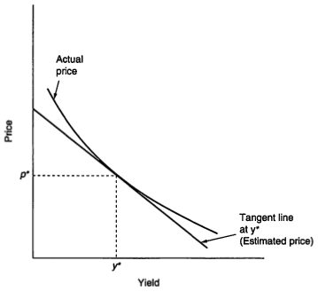
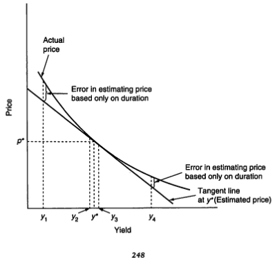
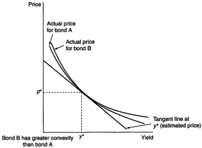
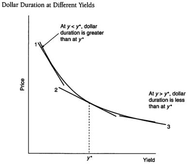
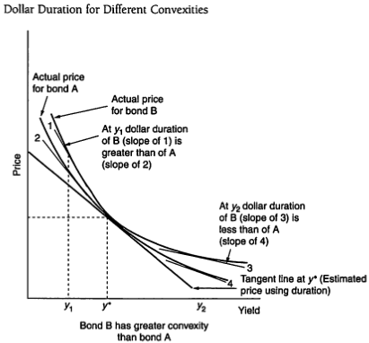
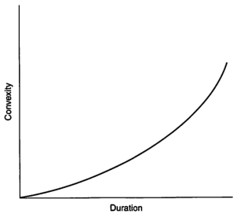

CHAPTER FOURTEEN

## COMBINING DURATION AND CONVEXITY TO MEASURE PRICE VOLATILITY

We're now ready to tie together the price/yield relationship and several of the properties about the bond price volatility that we discussed in previous chapters. Recall that the shape of the price/yield relationship is convex. It is the convex shape that gives rise to the properties. $^1$

### ESTIMATING PRICE WITH DURATION: A GRAPHICAL DIPLION

In the previous chapter, we explained how duration (modified or dollar) can be used to estimate price change when yield changes. In Exhibit 14–1 , a line is drawn tangent to the curve depicting the price/yield relationship at point $y^2$ . The tangent line shows the rate of change of price with respect to a change in interest rates at that point (yield). Consequently, the tangent line is directly related to the dollar duration of the bond. $^3$

How can the tangent line be used to approximate the new price if yield changes?

If we draw a vertical line from any yield (on the horizontal axis), as we do in

Exhibit 14–2, the distance between the horizontal axis and the tangent line represents the price as estimated using duration. Notice that the approximation will always

1. The formulas shown in this chapter are presented without proof. For a mathematical derivation of the formulas, see Frank J. Fabozio, Bond Markets, Analysis and Strategies (Englewood Cliffs, NJ: Prentice-Hall, 1996, 3rd ed), Chapter 4.

2. In nontechnical terms, a tangent line is defined as a line that touches the price/yield relationship at the point $y^{*}$ and does not touch the price/yield relationship at any other point.

3. Technically, the slope of the tangent line is the change in price for a change in yield, sometimes referred to as $p/dty$, a term adopted from calculus because the slope is the first derivative of the price function for a bond. The modified duration would be the slope of the tangent line if the price/yield relationship is drawn with the natural logarithm of the bond's price, rather than price, on the vertical axis. To simplify the discussion below, we shall refer to the slope of the tangent line as the dollar duration.

247

---

$$ EXHIBIT 14-1 $$

Tangent to Price/Yield Relationship

$$ EXXIIBIT 14-2 $$

Comparison of Two Bonds with Different Convexities but the Same Duration

---

CHAPTER 14 Combining Duration and Convexity to Measure Price Volatility

249

EXHIBIT 14-3

Comparison of Two Bonds with Different Convexities but the Same Duration

underestimate the actual price at the new yield. This agrees with what we illustrated in the previous chapter: duration leads to an underestimate of the new price.

For small changes in yield, the tangent line gives a satisfactory estimate of the actual price. However, the further we move from the initial yield, $y^*$ , the worse the approximation. It should be apparent that the accuracy of the approximation from using duration (the tangent line) depends on the convexity of the price/yield relationship for the bond. Exhibit 14–3 shows the convexity of two hypothetical bonds. Both have the same duration at $y^*$ , but bond A has less convexity than bond B. As a result, the duration-based approximation of the price is better for bond A than bond B.

## MEASURING CONVEXITY

Exhibit 14-3 indicates that how well we can approximate the new price will depend on the convexity of a bond. In this section, we give a formula for measuring the convexity of a bond at a given yield level. In the next section, we show how the price change due to convexity can be estimated.

4. In some books, convexity is referred to as the "convexity measure."

---

250

PART 4 Price Volatility for Option-Free Bonds

The convexity of an option-free bond at a given yield level is measured as follows:

$$\begin{array}{l}
 Convexity (in periods)  \\
=\frac{l(2) P V C F_{1}+2(3) P V C F_{2}+3(4) P V C F_{3}+\cdot s+n(n+1) P V C F_{n}}{(1+y)^{2} \times P V T C F},
\end{array}(14-1)$$

where $PVCF_t=$ Present value of the cash flow in period t discounted at the prevailing period yield (in the case of a semiannual-pay bond, onehalf the yield to maturity); t = Period when the cash flow is expected to be received ( $t=1,\ldots,n$ ); n = Number of periods until maturity; y = One-half the yield to maturity; $PVTCF=$ Total present value of the cash flow of the bond where the present value is determined by using the prevailing yield to maturity.

For a zero-coupon bond, the convexity in periods reduces to

$$\text{Convexity for a zero-coupon bond (in periods) }=\frac{n(n+1)}{(1+y)^{2}} .$$

To convert a bond's convexity from periods to years, the following formula is used:

$$Convexity (in years) = \frac{Convexity (in periods)}{k^2}.$$

where $k = Number of payments per year (i.e., k = 2 for semiannual-pay bonds, $k = 12 for monthly pay bonds).

For an option-free bond, the convexity measure will always be positive.

Exhibits 14-4 and 14-5 summarize the calculation of convexity for two of the hypothetical bonds (the 8%, 5-year bond and the 14%, 5-year bond) whose Macaulay durations are calculated in Exhibits 13-1 and 13-2 of Chapter 13, respectively, assuming each bond is selling to yield 10%. For the 5-year, zero-coupon bond, n = 10 (number of periods) and $\gamma$ is 0.05. Therefore

$$ Convexity =\frac{10(10+1)}{(1.05)^{2}}=24.94 .$$

---

CHAPTER 14 Combining Duration and Convexity to Measure Price Volatility

251

$$ EXHIBIT 14-4 $$

<table><tr><td colspan="5">Worksheet for Computation of Convexity for a 5-Year, 8% Coupon Bond Selling to Yield 10%</td></tr><tr><td colspan="5">Coupon rate = 8%; Term (years) = 5; Initial yield = 10%; Price = 92.27826.</td></tr><tr><td>Period (t)</td><td>Cash Flow</td><td>PVCF ($)</td><td>t(t + 1)</td><td>PVCF × t(t + 1) ($)</td></tr><tr><td>1</td><td>$4.00</td><td>$3,8095</td><td>2</td><td>$7,6190</td></tr><tr><td>2</td><td>4.00</td><td>3,6281</td><td>6</td><td>22,7887</td></tr><tr><td>3</td><td>4.00</td><td>3,4554</td><td>12</td><td>41,4642</td></tr><tr><td>4</td><td>4.00</td><td>3,2908</td><td>20</td><td>65,8162</td></tr><tr><td>5</td><td>4.00</td><td>3,1341</td><td>30</td><td>94,0231</td></tr><tr><td>6</td><td>4.00</td><td>2,9849</td><td>42</td><td>125,3642</td></tr><tr><td>7</td><td>4.00</td><td>2,8427</td><td>56</td><td>159,1926</td></tr><tr><td>8</td><td>4.00</td><td>2,7074</td><td>72</td><td>194,9297</td></tr><tr><td>9</td><td>4.00</td><td>2,5784</td><td>90</td><td>232,0592</td></tr><tr><td>10</td><td>104.00</td><td>63,8470</td><td>110</td><td>7,023,1676</td></tr><tr><td></td><td></td><td></td><td>Total</td><td>$7,965,4046</td></tr><tr><td colspan="5">Convexity (in half years) = $\frac{7,965,4046}{(1.05)^{2}92,27826} = 78.2942$.</td></tr><tr><td colspan="5">Convexity (in years) = $\frac{78,2942}{2^{2}} = 19.58$.</td></tr></table>

The convexities in years for the 12 hypothetical bonds we examined in the previous chapter are

<table><tr><td>Coupon (%)</td><td>Maturity (years)</td><td>Convexity</td></tr><tr><td>0.00%</td><td>5</td><td>24.94</td></tr><tr><td>0.00%</td><td>15</td><td>210.88</td></tr><tr><td>0.00%</td><td>30</td><td>829.94</td></tr><tr><td>8.00%</td><td>5</td><td>19.58</td></tr><tr><td>8.00%</td><td>15</td><td>94.36</td></tr><tr><td>8.00%</td><td>30</td><td>167.56</td></tr><tr><td>10.00%</td><td>5</td><td>18.74</td></tr><tr><td>10.00%</td><td>15</td><td>87.62</td></tr><tr><td>10.00%</td><td>30</td><td>158.70</td></tr><tr><td>14.00%</td><td>5</td><td>17.44</td></tr><tr><td>14.00%</td><td>15</td><td>76.90</td></tr><tr><td>14.00%</td><td>30</td><td>148.28</td></tr></table>

---

252

PART 4 Price Volatility for Option-Free Bonds

EXHIBIT 14-5

<table><tr><td colspan="5">Worksheet for Computation of Convexity for a 5-Year, 14% Coupon Bond Selling to Yield 10%</td></tr><tr><td colspan="5">Coupon rate = 14%; Term (years) = 5; Initial yield = 10%; Price = 115,4434.</td></tr><tr><td>Period (t)</td><td>Cash Flow ($)</td><td>PVCF ($)</td><td>t(t + 1)</td><td>PVCF × t(t + 1) ($)</td></tr><tr><td>1</td><td>$7.00</td><td>$6,6667</td><td>2</td><td>$13,333</td></tr><tr><td>2</td><td>7.00</td><td>6,3492</td><td>6</td><td>38,0952</td></tr><tr><td>3</td><td>7.00</td><td>6,0469</td><td>12</td><td>72,5624</td></tr><tr><td>4</td><td>7.00</td><td>5,7589</td><td>20</td><td>115,1783</td></tr><tr><td>5</td><td>7.00</td><td>5,4847</td><td>30</td><td>164,5405</td></tr><tr><td>6</td><td>7.00</td><td>5,2235</td><td>42</td><td>219,3873</td></tr><tr><td>7</td><td>7.00</td><td>4,9748</td><td>56</td><td>278,5871</td></tr><tr><td>8</td><td>7.00</td><td>4,7379</td><td>72</td><td>341,1270</td></tr><tr><td>9</td><td>7.00</td><td>4,5123</td><td>90</td><td>406,1036</td></tr><tr><td>10</td><td>107.00</td><td>65,6887</td><td>110</td><td>7,225,7590</td></tr><tr><td></td><td></td><td></td><td>Total</td><td>$8,874,6738</td></tr><tr><td colspan="5">Convexity (in half years) = $\frac{-8,874,6738}{(1,05)^{2}115,4434}$ = 69.7276.</td></tr><tr><td colspan="5">Convexity (in years) = $\frac{69,7276}{2^{2}}$ = 17.44.</td></tr></table>

What do these convexity numbers mean? How can they be used? We will answer these questions in the sections that follow.

## PERCENTAGE PRICE CHANGE DUE TO CONVEXITY

Modified duration provides a first approximation to the percentage change in price. Convexity provides a second approximation, based on the following relationship: $^2$

$$\begin{align}
& \text{Approximate percentage change in price due to convexity} \\
& = (0.5) \times \text{Convexity } \times (\text{Yield change})^{2}. \quad  (14-2)
\end{align}$$

Since the convexity measure is always positive for an option-free bond, the approximate percentage change in price due to convexity is positive for either an increase or a decrease in yield.

Illustration 14-1. Consider the 8%, 15-year bond selling to yield 10%. If the yield increases from 10% to 13% (a 30% basis point or 0.03 yield change), then the

5. In some books, approximate percentage change in price due to convexity is referred to as the "convexity adjustment."

---

CHAPTER 14 Combining Duration and Convexity to Measure Price Volatility

253

approximate percentage price change due to convexity is

$$(0.5) \times 94.36 \times(0.03)^{2}=0.0425=4.25 \% ,$$

If the yield decreases by 300 basis points, from 10% to 7%, the approximate percentage price change due to convexity is 4.25%.

Exhibit 14-6 shows the approximate percentage price change due to convexity for various changes in yield for each of the 12 hypothetical bonds.

## Alternative Formulations for Measuring Convexity and Percentage Price Change due to Convexity

There is no standard definition for measuring convexity. The one given by equation (14–1) is one possibility. The reason is that equation (14–1) can be scaled in different ways because what is important is not the measurement of convexity but the approximate percentage price change due to convexity as given by equation (14–2) . For example, in some books the measurement for convexity would include in equation (14–1) a 2 in the denominator. That is, the computed value will be one-half the value computed in equation (14–1) . This is not a problem because in that case, equation (14–2) would be changed by eliminating 0.5. The approximate percentage price change due to convexity will then be the same. Some vendors of fixed income analytics would actually divide convexity given by equation (14–1) by 100. Equation (14–2) would then be adjusted by multiplying by 100.

The important point here is that, unlike duration, it is sometimes difficult to compare the measure of convexity from different vendors because of the way convexity can be scaled. Hence, one vendor might calculate convexity for a Treasury bond to be 80 while another vendor reports it as 4. Both can be correct. What is important is that if a portfolio manager wants to use the convexity computed by either vendor, he must know how the equivalent of equation (14–1) is computed by the two vendors. This is needed to adjust equation (14–2) in order to calculate the approximate percentage price change due to convexity. If done properly, the percentage price change will be the same.

## PERCENTAGE PRICE CHANGE DUE TO DURATION AND CONVEXITY

The approximate percentage change in price resulting from both duration and convexity is found by simply adding the two estimates.

Illustration 14-2. For the 8%, 15-year bond selling to yield 10%, if yields change from 10% to 13%, we have

<table><tr><td>Price Change Based on</td><td>Approx. % Price Change</td></tr><tr><td>Duration</td><td>-24.15%</td></tr><tr><td>Convexity</td><td>+4.25</td></tr><tr><td>Total</td><td>-19.90%</td></tr></table>

---

$$ EXXIBIT 14-6 $$

<table><tr><td colspan="9">Percentage Price Change due to Convexity</td></tr><tr><td rowspan="2">Coupon (%)</td><td rowspan="2">Term (years)</td><td rowspan="2">Convexity</td><td colspan="6">Change (in basis points)</td></tr><tr><td>1</td><td>10</td><td>50</td><td>100</td><td>200</td><td>300</td></tr><tr><td>0%</td><td>5</td><td>24.94</td><td>0.00%</td><td>0.00%</td><td>0.03%</td><td>0.12%</td><td>0.50%</td><td>1.12%</td></tr><tr><td>0</td><td>15</td><td>219.88</td><td>0.00</td><td>0.01</td><td>0.26</td><td>1.05</td><td>4.22</td><td>9.49</td></tr><tr><td>0</td><td>30</td><td>829.94</td><td>0.00</td><td>0.04</td><td>1.04</td><td>4.15</td><td>16.60</td><td>37.35</td></tr><tr><td>8</td><td>5</td><td>19.58</td><td>0.00</td><td>0.00</td><td>0.02</td><td>0.10</td><td>0.39</td><td>0.88</td></tr><tr><td>8</td><td>15</td><td>94.36</td><td>0.00</td><td>0.00</td><td>0.12</td><td>0.47</td><td>1.89</td><td>4.25</td></tr><tr><td>8</td><td>30</td><td>167.56</td><td>0.00</td><td>0.01</td><td>0.21</td><td>0.84</td><td>3.35</td><td>7.54</td></tr><tr><td>10</td><td>5</td><td>18.74</td><td>0.00</td><td>0.00</td><td>0.02</td><td>0.09</td><td>0.37</td><td>0.84</td></tr><tr><td>10</td><td>15</td><td>87.62</td><td>0.00</td><td>0.00</td><td>0.11</td><td>0.44</td><td>1.75</td><td>3.94</td></tr><tr><td>10</td><td>30</td><td>158.70</td><td>0.00</td><td>0.01</td><td>0.20</td><td>0.79</td><td>3.17</td><td>7.14</td></tr><tr><td>14</td><td>5</td><td>17.44</td><td>0.00</td><td>0.00</td><td>0.02</td><td>0.09</td><td>0.35</td><td>0.78</td></tr><tr><td>14</td><td>15</td><td>78.90</td><td>0.00</td><td>0.00</td><td>0.10</td><td>0.39</td><td>1.58</td><td>3.55</td></tr><tr><td>14</td><td>30</td><td>148.28</td><td>0.00</td><td>0.01</td><td>0.19</td><td>0.74</td><td>2.97</td><td>6.67</td></tr></table>

254

---

CHAPTER 14 Combining Duration and Convexity to Measure Price Volatility

255

For a decrease of 300 basis points, from 10% to 7%:

<table><tr><td>Price Change Based on</td><td>Approx. % Price Change</td></tr><tr><td>Duration</td><td>+24.15%</td></tr><tr><td>Convexity</td><td>+4.25%</td></tr><tr><td>Total</td><td>28.40%</td></tr></table>

The actual percentage price change would be +29.03%.

Consequently, for large yield movements, a better approximation for bond price volatility is obtained by combining duration and convexity.

Exhibit 14-7 shows the percentage price changes due to both duration and convexity for our 12 hypothetical bonds. The percentage price change not explained by duration and convexity is shown in Exhibit 14-8. As can be seen from this exhibit, most of the change in price is explained by using duration and convexity.

## Dollar Convexity

In the previous chapter, we explained that dollar duration can be obtained by multiplying modified duration by the initial price. Dollar convexity can be obtained by multiplying convexity by the initial price:

$$Dollar convexity = Convexity  \times  Initial price.$$

To determine the dollar price change, the following formula is used:

$$\begin{aligned}
&  Dollar price change due to convexity  \\
& =\langle  0.5\rangle \times  Dollar convexity  \times( Yield change )^{2} .
\end{aligned}$$

Illustration 14-3. For the 8%, 15-year bond selling to yield 10%, the dollar convisity per $100 of par value is

$$94.36 \times \$ 84.63=\$ 7,985.69.$$

The dollar price change due to convexity per $100 of par value for a 100 basis point change is

$$(0.5)\times7,985.69\times(0.01)^{2}=$$0.399.$$

Thus, for a 100 basis point change, the price of the bond will change by approximately $0.40 per $100 par value due to convexity.

For a 200 basis point change, the dollar price change per $100 of par value

due to convexity is

1

$$(0.5)\times 7,985.69\times (0.02)^{2}=\$1.597.$$

For a 200 basis point change, the dollar price change due to convexity is approximately $1.60 per $100 of par value—quadruple the $0.40 for a 100 basis point change. Consequently, unlike dollar duration in which the dollar price change due to duration is proportionate to the change in yield—doubling the yield change

---

EXHIBIT 14-7

Estimated Percentage Price Change Using Duration and Convexity

<table><tr><td rowspan="3"></td><td rowspan="3">Term (years)</td><td colspan="6">Yield Change (in basis points) from 10%</td></tr><tr><td>1</td><td>10</td><td>50</td><td>100</td><td>200</td><td>300</td></tr><tr><td colspan="6">New Yield Level</td></tr><tr><td>Coupon (%)</td><td>5</td><td>-0.05%</td><td>10.10%</td><td>10.50%</td><td>11.00%</td><td>12.00%</td><td>13.00%</td></tr><tr><td>0%</td><td>5</td><td>-0.04</td><td>-0.47%</td><td>-2.35%</td><td>-4.64%</td><td>-9.02%</td><td>-13.16%</td></tr><tr><td>0</td><td>15</td><td>-0.14</td><td>-1.42</td><td>-6.88</td><td>-13.24</td><td>-24.36</td><td>-33.38</td></tr><tr><td>0</td><td>30</td><td>-0.29</td><td>-2.62</td><td>-13.25</td><td>-24.42</td><td>-40.54</td><td>-48.36</td></tr><tr><td>8</td><td>5</td><td>-0.04</td><td>-0.40</td><td>-1.97</td><td>-3.88</td><td>-7.57</td><td>-11.06</td></tr><tr><td>8</td><td>15</td><td>-0.08</td><td>-0.80</td><td>-3.91</td><td>-7.58</td><td>-14.21</td><td>-19.90</td></tr><tr><td>8</td><td>30</td><td>-0.10</td><td>-0.96</td><td>-4.65</td><td>-8.88</td><td>-16.09</td><td>-21.62</td></tr><tr><td>10</td><td>5</td><td>-0.04</td><td>-0.39</td><td>-1.91</td><td>-3.77</td><td>-7.35</td><td>-10.74</td></tr><tr><td>10</td><td>15</td><td>-0.08</td><td>-0.76</td><td>-3.74</td><td>-7.25</td><td>-13.63</td><td>-19.13</td></tr><tr><td>10</td><td>30</td><td>-0.09</td><td>-0.94</td><td>-4.53</td><td>-8.67</td><td>-15.75</td><td>-21.24</td></tr><tr><td>14</td><td>5</td><td>-0.04</td><td>-0.37</td><td>-1.81</td><td>-3.58</td><td>-6.99</td><td>-10.23</td></tr><tr><td>14</td><td>15</td><td>-0.07</td><td>-0.72</td><td>-3.51</td><td>-6.83</td><td>-12.86</td><td>-18.11</td></tr><tr><td>14</td><td>30</td><td>-0.09</td><td>-0.91</td><td>-4.40</td><td>-8.43</td><td>-15.37</td><td>-20.84</td></tr></table>

256

---

EXHIBIT 14-7

(Continued)

<table><tr><td rowspan="3"></td><td rowspan="3">Term (years)</td><td colspan="6">Yield Change (in basis points) from 10%</td></tr><tr><td>-1</td><td>-10</td><td>-50</td><td>-100</td><td>-200</td><td>-300</td></tr><tr><td colspan="6">New Yield Level</td></tr><tr><td>Coupon (%)</td><td>0%</td><td>5</td><td>9.99%</td><td>9.90%</td><td>9.50%</td><td>9.00%</td><td>8.00%</td></tr><tr><td>0%</td><td>0</td><td>15</td><td>0.05%</td><td>0.48%</td><td>2.41%</td><td>4.88%</td><td>10.02%</td></tr><tr><td>0</td><td>0</td><td>30</td><td>0.14</td><td>1.44</td><td>7.41</td><td>15.34</td><td>32.80</td></tr><tr><td>0</td><td>0</td><td>5</td><td>0.29</td><td>2.90</td><td>15.32</td><td>32.72</td><td>73.74</td></tr><tr><td>8</td><td>8</td><td>5</td><td>0.04</td><td>0.40</td><td>2.01</td><td>4.08</td><td>8.35</td></tr><tr><td>8</td><td>8</td><td>15</td><td>0.08</td><td>0.81</td><td>4.14</td><td>8.52</td><td>17.99</td></tr><tr><td>8</td><td>8</td><td>30</td><td>0.10</td><td>0.98</td><td>5.07</td><td>10.56</td><td>22.79</td></tr><tr><td>10</td><td>10</td><td>5</td><td>0.04</td><td>0.39</td><td>1.95</td><td>3.95</td><td>8.09</td></tr><tr><td>10</td><td>10</td><td>15</td><td>0.08</td><td>0.77</td><td>3.95</td><td>8.13</td><td>17.13</td></tr><tr><td>10</td><td>10</td><td>30</td><td>0.09</td><td>0.95</td><td>4.93</td><td>10.25</td><td>22.09</td></tr><tr><td>14</td><td>14</td><td>5</td><td>0.04</td><td>0.37</td><td>1.86</td><td>3.76</td><td>7.69</td></tr><tr><td>14</td><td>14</td><td>15</td><td>0.07</td><td>0.73</td><td>3.71</td><td>7.61</td><td>16.02</td></tr><tr><td>14</td><td>14</td><td>30</td><td>0.09</td><td>0.92</td><td>4.77</td><td>9.91</td><td>21.31</td></tr></table>

257

---

EXHIBIT 14-8

Estimated Percentage Price Change Not Explained by Using Both Duration and Convexity

<table><tr><td rowspan="3"></td><td rowspan="3">Term (years)</td><td colspan="6">Yield Change (in basis points) from 10%</td></tr><tr><td>1</td><td>10</td><td>50</td><td>100</td><td>200</td><td>300</td></tr><tr><td colspan="6">New Yield Level</td></tr><tr><td>Coupon (%)</td><td>5</td><td>0.00%</td><td>10.10%</td><td>10.50%</td><td>11.00%</td><td>12.00%</td><td>19.00%</td></tr><tr><td>0%</td><td>5</td><td>0.00%</td><td>0.00%</td><td>0.00%</td><td>0.00%</td><td>-0.02%</td><td>-0.07%</td></tr><tr><td>0</td><td>15</td><td>0.00</td><td>0.00</td><td>0.00</td><td>-0.05</td><td>-0.39</td><td>-1.28</td></tr><tr><td>0</td><td>30</td><td>0.00</td><td>0.00</td><td>-0.05</td><td>-0.38</td><td>-2.83</td><td>-8.94</td></tr><tr><td>8</td><td>5</td><td>0.00</td><td>0.00</td><td>0.00</td><td>0.00</td><td>-0.02</td><td>-0.05</td></tr><tr><td>8</td><td>15</td><td>0.00</td><td>0.00</td><td>0.00</td><td>0.00</td><td>-0.15</td><td>-0.51</td></tr><tr><td>8</td><td>30</td><td>0.00</td><td>0.00</td><td>-0.01</td><td>-0.06</td><td>-0.43</td><td>-1.39</td></tr><tr><td>10</td><td>5</td><td>0.00</td><td>0.00</td><td>0.00</td><td>0.00</td><td>-0.01</td><td>-0.05</td></tr><tr><td>10</td><td>15</td><td>0.00</td><td>0.00</td><td>0.00</td><td>-0.01</td><td>-0.14</td><td>-0.46</td></tr><tr><td>10</td><td>30</td><td>0.00</td><td>0.00</td><td>-0.01</td><td>-0.06</td><td>-0.42</td><td>-1.31</td></tr><tr><td>14</td><td>5</td><td>0.00</td><td>0.00</td><td>0.00</td><td>0.00</td><td>-0.01</td><td>-0.04</td></tr><tr><td>14</td><td>15</td><td>0.00</td><td>0.00</td><td>0.00</td><td>-0.02</td><td>-0.13</td><td>-0.41</td></tr><tr><td>14</td><td>30</td><td>0.00</td><td>0.00</td><td>-0.01</td><td>-0.05</td><td>-0.36</td><td>-1.17</td></tr></table>

258

---

EXHIBIT 14-8

(Continued)

<table><tr><td rowspan="3"></td><td rowspan="3">Term (years)</td><td colspan="6">Yield Change (in basis points) from 10%</td></tr><tr><td>-1</td><td>-10</td><td>-50</td><td>-100</td><td>-200</td><td>-300</td></tr><tr><td colspan="6">New Yield Level</td></tr><tr><td>Coupon (%)</td><td>Term (years)</td><td>9.99%</td><td>9.90%</td><td>9.50%</td><td>9.00%</td><td>8.00%</td><td>7.00%</td></tr><tr><td>0%</td><td>5</td><td>0.00%</td><td>0.00%</td><td>0.00%</td><td>0.00%</td><td>0.02%</td><td>0.07%</td></tr><tr><td>0</td><td>15</td><td>0.00</td><td>0.00</td><td>0.00</td><td>0.05</td><td>0.46</td><td>1.62</td></tr><tr><td>0</td><td>30</td><td>0.00</td><td>0.00</td><td>0.05</td><td>0.44</td><td>3.83</td><td>14.05</td></tr><tr><td>8</td><td>5</td><td>0.00</td><td>0.00</td><td>0.00</td><td>0.00</td><td>0.02</td><td>0.05</td></tr><tr><td>8</td><td>15</td><td>0.00</td><td>0.00</td><td>0.00</td><td>0.02</td><td>0.18</td><td>0.64</td></tr><tr><td>8</td><td>30</td><td>0.00</td><td>0.00</td><td>0.01</td><td>0.06</td><td>0.56</td><td>2.03</td></tr><tr><td>10</td><td>5</td><td>0.00</td><td>0.00</td><td>0.00</td><td>0.00</td><td>0.02</td><td>0.05</td></tr><tr><td>10</td><td>15</td><td>0.00</td><td>0.00</td><td>0.00</td><td>0.02</td><td>0.16</td><td>0.58</td></tr><tr><td>10</td><td>30</td><td>0.00</td><td>0.00</td><td>0.01</td><td>0.07</td><td>0.53</td><td>1.90</td></tr><tr><td>14</td><td>5</td><td>0.00</td><td>0.00</td><td>0.00</td><td>0.00</td><td>0.01</td><td>0.04</td></tr><tr><td>14</td><td>15</td><td>0.00</td><td>0.00</td><td>0.00</td><td>0.02</td><td>0.14</td><td>0.51</td></tr><tr><td>14</td><td>30</td><td>0.00</td><td>0.00</td><td>0.01</td><td>0.05</td><td>0.46</td><td>1.69</td></tr></table>

259

---

260

PART 4 Price Volatility for Option-Free Bonds

from 100 basis points to 200 basis points, for example, doubles the dollar price change due to duration—the dollar price change due to convexity changes more than proportionately.

## CONVEXITY AS A MEASURE OF THE CHANGE IN DOLLAR DURATION

The tangent line in Exhibit 14-1 is a measure of the dollar duration of the price/yield relationship at point y*. The steeper the tangent lines, the greater is the dollar duration; the flatter the lines, the lower is the dollar duration.

Exhibit 14–9 graphically depicts what happens to the dollar duration as the yield changes. Notice that for an option-free bond, as the yield declines below $y^*$ , the dollar duration increases; as the yield increases above $y^*$ , the dollar duration decreases. This is true for all option-free bonds: the dollar duration increases as the yield decreases and decreases as the yield increases . Exhibit 14–10 shows the dollar duration for each of our 12 hypothetical bonds for various yields and confirms our graphical illustration.

Why is this property of an option-free bond attractive? As the yield declines, an investor who is long a bond would want its price to increase as much as possible— hence, an investor wants dollar duration to increase. The opposite is true if the yield increases. An investor wants the dollar duration to decline when the yield increases.

EXHIBIT 14-9

---

261

EXHIBIT 14-10

Dollar Duration per 100 Basis Points per $100 Par Value

<table><tr><td colspan="9">Dollar Duration per 100 Basis Points per$100 Par Value</td></tr><tr><td rowspan="2">Coupon (%)</td><td rowspan="2">Term (years)</td><td colspan="7">Yield Level</td></tr><tr><td>4%</td><td>6%</td><td>8%</td><td>10%</td><td>12%</td><td>14%</td><td>16%</td></tr><tr><td>0%</td><td>5</td><td>$4.02</td><td>$3.61</td><td>$3.25</td><td>$2.92</td><td>$2.63</td><td>$2.38</td><td>$2.14</td></tr><tr><td>0</td><td>15</td><td>8.12</td><td>6.00</td><td>4.45</td><td>3.31</td><td>2.46</td><td>1.84</td><td>1.38</td></tr><tr><td>0</td><td>30</td><td>8.96</td><td>4.94</td><td>2.74</td><td>1.53</td><td>0.86</td><td>0.48</td><td>0.27</td></tr><tr><td>8</td><td>5</td><td>5.14</td><td>4.65</td><td>4.21</td><td>3.82</td><td>3.47</td><td>3.16</td><td>2.87</td></tr><tr><td>8</td><td>15</td><td>14.72</td><td>11.45</td><td>8.98</td><td>7.10</td><td>5.67</td><td>4.57</td><td>3.71</td></tr><tr><td>8</td><td>30</td><td>26.48</td><td>17.34</td><td>11.75</td><td>8.24</td><td>5.98</td><td>4.48</td><td>3.46</td></tr><tr><td>10</td><td>5</td><td>5.42</td><td>4.91</td><td>4.45</td><td>4.04</td><td>3.68</td><td>3.35</td><td>3.05</td></tr><tr><td>10</td><td>15</td><td>16.37</td><td>12.81</td><td>10.11</td><td>8.05</td><td>6.47</td><td>5.25</td><td>4.30</td></tr><tr><td>10</td><td>30</td><td>30.86</td><td>20.44</td><td>14.00</td><td>9.92</td><td>7.26</td><td>5.48</td><td>4.28</td></tr><tr><td>14</td><td>5</td><td>5.97</td><td>5.43</td><td>4.93</td><td>4.49</td><td>4.10</td><td>3.74</td><td>3.42</td></tr><tr><td>14</td><td>15</td><td>19.67</td><td>15.53</td><td>12.38</td><td>9.95</td><td>8.07</td><td>6.61</td><td>5.46</td></tr><tr><td>14</td><td>30</td><td>39.61</td><td>26.64</td><td>18.50</td><td>13.27</td><td>9.82</td><td>7.48</td><td>5.85</td></tr></table>

---

262

PART 4 Price Volatility for Option-Free Bonds

For this reason, investors commonly refer to the shape of the price/yield relationship for an option-free bond as having “ positive ” convexity, “ positive ” indicating that it is a good attribute of a bond. It is because of positive convexity that we observed the property in Chapter 12 that the increase in price will be greater than the decrease in price for a given change in yield. In Chapter 18, we’ll discuss bonds that have “ negative ” convexity, which means that dollar duration does not change in the desired direction.

Exhibit 14-11 is the same as Exhibit 14-3, which shows the price/yield relationship of two bonds, A and B, with different convexities. Bond B has greater convexity than bond A, while both have the same duration. Bond B is preferred over bond A because it provides a higher bond price regardless of how yield changes— greater price appreciation if yield declines, and smaller price loss if yield increases. Notice that the steepness of bond B is greater than that of bond A at yields below $^*$. This means that the dollar duration of bond B is greater than bond A if the yield decreases. Thus, the investor realizes greater price appreciation from bond B than from bond A. Look at what happens if the yield increases above $^*$*. The tangent line is flatter for bond B than for bond A, indicating a lower dollar duration for

$$ EXXIBIT 14-11 $$

---

CHAPTER 14 Combining Duration and Convexity to Measure Price Volatility

263

bond B than for bond A. The investor in bond B realizes a smaller price decline than the investor in bond A.

Exhibit 14–12 shows for each of our 12 hypothetical bonds the percentage change in dollar duration per 100 basis points per $100 par value, assuming an initial yield of 10%. This exhibit is constructed from the dollar durations in Exhibit 14–10. Also shown is the convexity for each bond at a 10% yield. Notice that the change in dollar duration is greater the higher the convexity. Convexity measures the rate of change of dollar duration for a bond.

## SUMMARY OF PROPERTIES OF CONVEXITY

The convexity properties of all option-free bonds are summarized below.

Property 1 As the yield increases (decreases), the dollar duration of a bond decreases (increases). We demonstrated this in the previous section.

Property 2 For a given yield and maturity, the lower the coupon, the greater the convexity of a bond. This can be seen from the computed convexity of our 12 hypothetical bonds. An implication of this property is that for two bonds with the same maturity, a zero-coupon bond has greater convexity than a coupon bond.

Property 3 For a given yield and modified duration, the lower the coupon, the smaller the convexity. The investment implication of this property is that zero-coupon bonds have the lowest convexity for a given modified duration.

To see this, consider three bonds:

<table><tr><td>Coupon (%)</td><td>Maturity (years)</td><td>Yield to Maturity (%)</td><td>Modified Duration (years)</td><td>Convexity</td></tr><tr><td>11.625%</td><td>10.00</td><td>10%</td><td>6.05</td><td>50.48</td></tr><tr><td>5.500</td><td>8.00</td><td>10</td><td>6.02</td><td>44.87</td></tr><tr><td>0</td><td>6.33</td><td>10</td><td>6.03</td><td>39.24</td></tr></table>

Notice that all three bonds are selling to yield 10% and have a modified duration of approximately 6 years. $^6$ The convexity of the bonds decreases as the coupon rate decreases.

Property 4 The convexity of a bond increases at an increasing rate as duration increases. This is depicted in Exhibit 14–13. Doubling duration, for example, will more than double convexity.

4. A 6-year, zero-coupon bond has a Macaulay duration equal to its maturity. It has a modified duration that is less than 6 years.

---

EXHIBIT 14-12

Percentage Change in Dollar Duration per 100 Basis Points per $100 Par Value (initial yield is 10%)

<table><tr><td colspan="9">Assumption: Initial yield = 10%; Convexity computed at 10% yield.</td></tr><tr><td>Coupon (%)</td><td>Term (years)</td><td>Convexity</td><td>4%</td><td>6%</td><td>8%</td><td>12%</td><td>14%</td><td>16%</td></tr><tr><td>0%</td><td>5</td><td>24.94</td><td>37.6%</td><td>23.6%</td><td>11.1%</td><td>-9.9%</td><td>-18.7%</td><td>-26.6%</td></tr><tr><td>0</td><td>15</td><td>210.88</td><td>145.6</td><td>81.5</td><td>34.5</td><td>-25.5</td><td>-44.3</td><td>-58.2</td></tr><tr><td>0</td><td>30</td><td>829.94</td><td>466.1</td><td>223.2</td><td>79.3</td><td>-43.9</td><td>-68.4</td><td>-82.1</td></tr><tr><td>8</td><td>5</td><td>19.58</td><td>34.5</td><td>21.7</td><td>10.2</td><td>-9.2</td><td>-17.4</td><td>-24.8</td></tr><tr><td>8</td><td>15</td><td>94.36</td><td>107.2</td><td>61.2</td><td>26.4</td><td>-20.2</td><td>-35.7</td><td>-47.7</td></tr><tr><td>8</td><td>30</td><td>167.56</td><td>221.4</td><td>110.5</td><td>42.6</td><td>-27.4</td><td>-45.6</td><td>-58.0</td></tr><tr><td>10</td><td>5</td><td>18.74</td><td>33.9</td><td>21.3</td><td>10.1</td><td>-9.0</td><td>-17.1</td><td>-24.4</td></tr><tr><td>10</td><td>15</td><td>87.62</td><td>103.3</td><td>59.1</td><td>25.6</td><td>-19.6</td><td>-34.8</td><td>-46.6</td></tr><tr><td>10</td><td>30</td><td>158.70</td><td>211.2</td><td>106.1</td><td>41.2</td><td>-26.8</td><td>-44.7</td><td>-57.1</td></tr><tr><td>14</td><td>5</td><td>17.44</td><td>33.0</td><td>20.8</td><td>9.8</td><td>-8.8</td><td>-16.7</td><td>-23.9</td></tr><tr><td>14</td><td>15</td><td>78.90</td><td>97.6</td><td>56.1</td><td>24.4</td><td>-18.9</td><td>-33.6</td><td>-45.1</td></tr><tr><td>14</td><td>30</td><td>148.28</td><td>198.5</td><td>100.7</td><td>39.4</td><td>-26.0</td><td>-43.6</td><td>-55.9</td></tr></table>

264

---

CHAPTER 14 Combining Duration and Convexity to Measure Price Volatility

265

### EXHIBIT 14-13

Property 4: Relationship between Duration and Convexity

## VALUE OF CONVEXITY

Look again at exhibit 14-3, where bonds A and B have the same duration but different convexities. We stated that bond B would be preferred to bond A because both have the same price (same yield) and the same duration, but bond B has greater convexity than bond A. Thus, it offers better price performance if yield changes.

Generally, the market will take the greater convexity of bond B compared to bond A into account in pricing the two bonds. That is, the market prices convexity. Consequently, while there may be times when a situation such as depicted in Exhibit 14-3 may exist, generally the market will require investors to "pay up" (accept a lower yield) for the greater convexity offered by bond B.

How much should the market want investors to pay for convexity? Look again at Exhibit 14-3. Notice that if investors expect that yields will change by very little—that is, they expect low interest-rate volatility—the advantage of owning bond B over bond A is insignificant because the two bonds will offer approximately the same price performance for small changes in yield. Thus investors should not be willing to pay much for convexity. In fact, if the market is pricing convexity high, which means that bond A will be offering a higher yield than bond B, then investors with expectations of low interest-rate volatility would probably be willing to “sell convexity”—sell bond B if they own it, and buy bond A. In contrast, if investors expect substantial interest-rate volatility, bond B would probably sell at a much lower yield than bond A.

---

266

PART 4 Price Volatility for Option-Free Bonds

Illustration 14-4. To see how two portfolios with the same dollar duration but with different convexities can perform differently, consider the three bonds shown in Exhibit 14-14 and the following two portfolios. 7 One portfolio consists of only bond C, the 10-year bond and shall be referred to as the “bullet portfolio.” A second portfolio consists of 50.2% of bond A and 49.8% of bond B; this portfolio shall be referred to as the “barbell portfolio.” The dollar duration per 100 basis point change in yield of the bullet portfolio is $6.43409. Recall from Chapter 13 that dollar duration is a measure of the dollar price sensitivity of a bond or a portfolio. As shown in Exhibit 14-14, the dollar duration per 100 basis point change in yield of the barbell — which is just the weighted average of the dollar duration of the two bonds — is the same as for the bullet portfolio. In fact, the barbell portfolio was designed to produce this result. The dollar convexity of the two portfolios, shown in Exhibit 14-14, is not equal. The dollar convexity of the bullet portfolio is less than that of the barbell portfolio.

The “yield” for the two portfolios is not the same. The yield (yield to maturity) for the bullet portfolio is simply the yield to maturity of bond C, 9.25%. The traditional yield calculation for the barbell portfolio, which is found by taking a weighted average of the yield to maturity of the two bonds included in the portfolio, is 8.998%. This would suggest that the “yield” of the bullet portfolio is 25.2 basis points greater than that for the barbell portfolio. Alternatively, a cash flow yield can be approximated for the barbell portfolio by calculating the dollar-duration marketweighted yield of the portfolio. As shown in Exhibit 14-14, the cash flow yield of the barbell portfolio is 9.187%, suggesting that the “yield” of the bullet portfolio is 6.3 basis points greater than the barbell portfolio. Thus, both portfolios have the same dollar duration but, using either yield measure, the yield of the bullet portfolio is greater than the yield of the barbell portfolio. However, the dollar convexity of the barbell portfolio is greater than that of the bullet portfolio. The difference in the two yields is sometimes referred to as the “cost of convexity.”

Exhibit 14-15 shows the difference in the total return over a 6-month investment horizon for the two portfolios, assuming that the yields for all three bonds change by the same number of basis points shown in the first column. $^8$ The total return reported in the second column of Exhibit 14-15 is

Bullet portfolio's total return - Barbell portfolio's total return.

Thus, a positive sign in the second column means that the bullet portfolio outperformed the barbell portfolio, while a negative sign means that the barbell portfolio outperformed the bullet portfolio.

7. This illustration is adapted from Ravi E. Dattaurreya and Frank J. Fobozzi, Active Total Return Management of Fixed Income Portfolios (Chicago: Probus Publishing, 1989).

8. Note that no assumption is needed for the reinvestment rate since the three bonds shown in Exhibit 14-14 are assumed to be trading right after a coupon payment has been made and therefore there is no accrued interest.

---

CHAPTER 14 Combining Duration and Convexity to Measure Price Volatility

267

## EXHIBIT 14-14

Barbell-Bullet Analysis

<table><tr><td colspan="7">Three Bonds Used in Analysis</td></tr><tr><td>Bond</td><td>Coupon (%)</td><td>Maturity (years)</td><td>Price Plus Accrued</td><td>Yield (%)</td><td>Dollar Duration*</td><td>Dollar Convexity*</td></tr><tr><td>A</td><td>8.50%</td><td>5</td><td>100</td><td>8.50%</td><td>4.00544</td><td>19.8164</td></tr><tr><td>B</td><td>9.50</td><td>20</td><td>100</td><td>9.50</td><td>8.88151</td><td>124.1702</td></tr><tr><td>C</td><td>9.25</td><td>10</td><td>100</td><td>9.25</td><td>6.43409</td><td>55.4506</td></tr><tr><td colspan="7">Bullet portfolio = Bond C; Barbell portfolio = Bond A and B; Composition of barbell portfolio = 50.2% of bond A; 49.8% of bond B.</td></tr><tr><td colspan="7">Dollar duration of barbell</td></tr><tr><td colspan="7">= 0.502 × 4.00544 + 0.498 × 8.88151 = 6.434.</td></tr><tr><td colspan="7">Average yield of barbell</td></tr><tr><td colspan="7">= 0.502 × 8.50 + 0.498 × 9.5 = 8.998.</td></tr><tr><td colspan="7">Cash flow yield of barbell**</td></tr><tr><td colspan="7">= (8.5 × 0.502 × 4.00544) + (9.5 × 0.498 × 8.88151) - 6.434</td></tr><tr><td colspan="7">Yield pickup = Yield on bullet = Cash flow yield of barbell = 9.24 - 9.187 = 0.063, or 6.3 basis points.</td></tr><tr><td colspan="7">Analysis based on duration, convexity, and average yield:</td></tr><tr><td colspan="7">Dollar convexity of barbell</td></tr><tr><td colspan="7">= 0.502 × 19.8164 + 0.498 × 124.1702 = 71.7846.</td></tr><tr><td colspan="7">Yield pickup = Yield on bullet = Average yield of barbell = 9.25 - 8.998 = 0.252, or 25.2 basis points</td></tr><tr><td colspan="7">Convexity give-up = Convexity of barbell - Convexity of bullet = 71.7846 - 55.4506 = 16.334.</td></tr></table>

' Per 100 basis point change in yield. '"The calculation shown is actually a dollar-duration weighted yield, a very close approximation to cash flow yield.

Which portfolio is the better investment alternative if the yields of all three bonds change by the same amount and the investment horizon is 6 months? The answer depends on the amount by which yields change. Notice in the second column that if yields change by less than 100 basis points, the bullet portfolio will outperform the barbell portfolio. The reverse is true if yields change by more than 100 basis points.

The key point here is that looking at measures such as yield (yield to maturity or some type of portfolio yield measure), duration, or convexity tells us little

---

268

PART 4 Price Volatility for Option-Free Bonds

$$ EXHIBIT 14-15 $$

Relative Performance of Bullet Portfolio and Barbell Portfolio over a 6-Month Investment Horizon

<table><tr><td>Yield Change</td><td>Difference in Total Return</td><td>Yield Change</td><td>Difference in Total Return</td></tr><tr><td>-5.000</td><td>-7.19</td><td>0.250</td><td>0.24</td></tr><tr><td>-4.750</td><td>-6.26</td><td>0.500</td><td>0.21</td></tr><tr><td>-4.500</td><td>-5.44</td><td>0.750</td><td>0.16</td></tr><tr><td>-4.250</td><td>-4.68</td><td>1.000</td><td>0.09</td></tr><tr><td>-4.000</td><td>-4.00</td><td>1.250</td><td>0.01</td></tr><tr><td>-3.750</td><td>-3.38</td><td>1.500</td><td>-0.08</td></tr><tr><td>-3.500</td><td>-2.62</td><td>1.750</td><td>-0.19</td></tr><tr><td>-3.250</td><td>-2.32</td><td>2.000</td><td>-0.31</td></tr><tr><td>-3.000</td><td>-1.88</td><td>2.250</td><td>-0.44</td></tr><tr><td>-2.750</td><td>-1.49</td><td>2.500</td><td>-0.58</td></tr><tr><td>-2.500</td><td>-1.15</td><td>2.750</td><td>-0.73</td></tr><tr><td>-2.250</td><td>-0.85</td><td>3.000</td><td>-0.88</td></tr><tr><td>-2.000</td><td>-0.59</td><td>3.250</td><td>-1.05</td></tr><tr><td>-1.750</td><td>-0.38</td><td>3.500</td><td>-1.21</td></tr><tr><td>-1.500</td><td>-0.20</td><td>3.750</td><td>-1.39</td></tr><tr><td>-1.250</td><td>-0.05</td><td>4.000</td><td>-1.57</td></tr><tr><td>-1.000</td><td>0.06</td><td>4.250</td><td>-1.75</td></tr><tr><td>-0.750</td><td>0.15</td><td>4.500</td><td>-1.93</td></tr><tr><td>-0.500</td><td>0.21</td><td>4.750</td><td>-2.12</td></tr><tr><td>-0.250</td><td>0.24</td><td>5.000</td><td>-2.31</td></tr><tr><td>0.000</td><td>0.25</td><td></td><td></td></tr></table>

Note: Performance is based on the difference in total return over the 6-month investment horizon.

Bullet portfolio's total return = Barbell portfolio's total return.

Therefore a negative value means that the barbell portfolio outperformed the bullet portfolio.

about performance over some investment horizon because performance depends on the magnitude of the change in yields. Moreover, as we shall see in Chapter 15, the relative performance will also depend on the relative change in yields of each bond.

## APPROXIMATING CONVEXITY: EFFECTIVE CONVEXITY

The convexity measure of any bond can be approximated using the following formula:

$$Convexity=\frac{V_{x}+V_{y}-2V_{0}}{V_{x}(\Delta y)^{2}}.$$

---

CHAPTER 14 Combining Duration and Convexity to Measure Price Volatility

269

$$ where $$

$V_{0}=$ Initial value or price of the security; $\Delta y=$ Change in the yield of a security; $V_{c}=$ Estimated value of the security if the yield is decreased by $\Delta y$; $V_{e}=$ Estimated value of the security if the yield is increased by $\Delta y$.

These are the same values used for approximating duration.

For example, consider the 20-year, 7 % coupon bond selling at $74.26 to yield 10% that we used in the previous chapter to illustrate how to approximate modified duration. Suppose we evaluate the price changes for a 20 basis point change up and down. Then,

$$V_{+}=72.92 ;$$

$$V_{s}=75.64 ;$$

$$V_{0}=74.26 ;$$

$$\Delta y = 0 . 0 0 2 .$$

Substituting these values in the formula:

$$2 7 2 . 9 2 + 7 5 . 6 4 - 2 ( 7 4 . 2 6 ) \over ( 7 4 . 2 6 ) ( 0 . 0 0 2 ) = 1 3 4 . 6 6 ,$$

the convexity is equal to 132.08. The approximate convexity (134.66) has proven itself to be a good approximation of convexity (132.08).

## Effective Convexity

Just as in the case of modified duration, the convexity measure discussed in this chapter does not take into consideration how the cash flows may change if yield changes. In later chapters, we can use the formula above to calculate the convexity of a bond when there are interest-rate-sensitive cash flows. When the formula above is used in this way, the resulting convexity is called effective convexity because it allows the cash flow to change as yields change.

## SUMMARY

In this chapter, we have presented a graphical explanation of how duration is used to approximate the change in price when yield changes. We showed why duration will underestimate the new price and why the error in estimating the price becomes greater for large yield changes. The explanation lies in the convex shape of the price/yield relationship for an option-free bond. We then introduced a convexity measure for an option-free bond to provide a formula that links the convexity measure to price change.

---

270

PART 4 Price Volatility for Option-Free Bonds

The convexity of a bond will determine its price performance when yield changes. For two bonds with the same duration and the same yield to maturity, the bond with the greater convexity will be the more attractive. Typically, convexity does not come without a cost, however. The cost is the yield give-up necessary to improve convexity. Just how much investors should be willing to pay for better convexity depends on their expectations about the volatility of future interest rates. The greater the expected volatility, the more investors should be willing to pay for convexity. Trades that hold duration constant and improve convexity may enhance return over some specified holding period if the movement in yield is sufficient to offset the cost of obtaining the better convexity.

