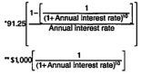

CHAPTER 7 Conventional Yield and Spread Measures for Bonds

101

### EXHIBIT 7-3

Computation of Yield to Maturity for an Annual-Pay Bond with 10 Years to Maturity, a Coupon Rate of 9.125%, and a Price of $993.33 (Par $1,000)

Objective: Find the annual interest rate that makes the present value of the following cash flows equal to $993.33;

10 coupon payments of $91.25, $1,000, 10 years from now.

<table><tr><td>Annual Interest Rate (%)</td><td>Present Value of 10 Payments of$91.25 ()</td><td>Present Value of$1,000, 10 Years from Now ()*</td><td>Present Value of Cash Flows ()**</td></tr><tr><td>9.18%</td><td>$581.00</td><td>$415.50</td><td>$996.50</td></tr><tr><td>9.19</td><td>$580.75</td><td>$415.12</td><td>$995.86</td></tr><tr><td>9.20</td><td>$580.49</td><td>$414.74</td><td>$995.23</td></tr><tr><td>9.21</td><td>$580.24</td><td>$414.36</td><td>$994.60</td></tr><tr><td>9.22</td><td>$579.98</td><td>$413.98</td><td>$993.96</td></tr><tr><td>9.23</td><td>$579.73</td><td>$413.60</td><td>$993.33</td></tr></table>

Illustration 7-10. Suppose an investor wants to compare the yield to maturity of a 10-year, 9.125% coupon Eurobond and the yield to maturity of a 10-year, 9% coupon U.S. bond issue. A Eurobond issue is an annual-pay bond. Suppose that the price of the Eurobond is $993.33 and the U.S. bond issue is $990.31. From Illustration 7-8, we know that the yield to maturity is 9.23%, and from Illustration 7-9, we know that the yield to maturity on a bond-equivalent basis is 9.03%. For the U.S. bond issue, the yield to maturity on a bond-equivalent basis is 9.15% if the price is $990.31. To convert this yield to an annual-pay basis, the previous formula is used:

$$\left(1+\frac{0.0915}{2}\right)^{-1}=1=0.0936=9.36 \% .$$

Notice that the yield to maturity on an annual basis is always greater than the yield to maturity on a bond-equivalent basis.

---

102

PART 2 Option-Free Bonds and Conventional Yield Measures

Below we have a comparison for our two hypothetical bonds:

<table><tr><td>Issue</td><td>Coupon Rate (%)</td><td>Price ($)</td><td>Yield on a Bond-Equivalent Basis (%)</td><td>Yield on an Annualized Basis (%)</td></tr><tr><td>Eurobond</td><td>9.125%</td><td>$993.33</td><td>9.03%</td><td>9.23%</td></tr><tr><td>U.S.</td><td>9.000</td><td>990.31</td><td>9.15</td><td>9.36</td></tr></table>

The above summary shows that the yield on the U.S. bond issue is higher than the yield on the Eurobond issue whether calculated on a bond-equivalent basis or an annual basis. An improper comparison of the unadjusted yield—9.23% for the Eurobond issue and 9.15% for the U.S. bond issue—would give a different conclusion.

## YIELD TO CALL

An issue may have a provision granting the issuer an option to buy back all or part of the issue prior to the stated maturity date. The right of the issuer to retire the issue prior to the stated maturity date is referred to as a call option and the bond is said to be a callable bond. If an issuer exercises this right, the issuer is said to "call the bond." The price which the issuer must pay to retire the issue is referred to as the call price. Typically, there is not one call price but a call schedule which sets forth a call price based on when the issuer can exercise the call option.

When a bond is issued, typically the issuer may not call the bond for a number of years. That is, the issue is said to have a deferred call. The date at which the bond may first be called is referred to as the first call date.

Generally, the call schedule is such that the call price at the first call date is a premium over the par value and scaled down to the par value over time. The date at which the issue is first callable at par value is referred to as the first par call date. For example, consider an 8.7% hypothetical bond issued on January 15, 2006, and maturing January 15, 2036. Suppose the first call date is January 15, 2016. Thus, at issuance this corporate bond had a 10-year deferred call. The call schedule for this issue is as follows:

<table><tr><td>If Redeemed during the 12 Months Beginning January 15</td><td>Call Price ($)</td></tr><tr><td>2016</td><td>$103,949</td></tr><tr><td>2017</td><td>103,554</td></tr><tr><td>2018</td><td>103,159</td></tr><tr><td>2019</td><td>102,764</td></tr><tr><td>2020</td><td>102,369</td></tr><tr><td>2021</td><td>101,975</td></tr><tr><td>2022</td><td>101,580</td></tr><tr><td>2023</td><td>101,185</td></tr><tr><td>2024</td><td>100,790</td></tr><tr><td>2025</td><td>100,395</td></tr><tr><td>2026 and thereafter</td><td>100,000</td></tr></table>

---

CHAPTER 7 Conventional Yield and Spread Measures for Bonds

103

The first par call date for this issue is January 15, 2026.

When a bond is callable, an investor can calculate a yield to an assumed call date. The yield to call is the interest rate that makes the present value of the cash flows to the assumed call date equal to the dirty price of the bond. Mathematically, the yield to an assumed call date for a bond on which the next coupon payment will be due 6 months from now can be expressed as follows:

$$p=\frac{(1+y)^{n}}{(1+y)^{n}}+\frac{c}{(1+y)^{2}}+\frac{c^{2}}{(1+y)^{3}}+\cdot s+\frac{c^{n}}{(1+y)^{m}}+\frac{CP}{(1+y)^{m+1}}$$

where

p = Price ($); c = Semiannual coupon interest ($); y = one-half the yield to call (in decimal form); n* = Number of periods until assumed call date (number of years × 2); CP = Call price at assumed call date from the call schedule.

For a semiannual-pay bond, doubling the interest rate (y) gives the yield to call.

Alternatively, the yield to call can be expressed as follows:

$$p = \sum _ { i = 1 } ^ { M } \frac { c } { ( 1 + y ) ^ { i } } + \frac { c p } { ( 1 + y ) ^ { M } } .$$

Two commonly used call dates are the first call date and the first par call date. To calculate the yield to the first call date, the value for CP used in the formula is the call price on the first call date as given in the call schedule. In computing the yield to the first par call date, the par value is used for CP in the formula.

The next two illustrations show how to calculate the yield to the first call date.

Illustration 7-11. In Illustrations 7-1 and 7-3 we computed the current yield and yield to maturity for an 18-year, 6% coupon bond selling for $700.89. Suppose that this bond is first callable in 5 years at $1,030. The cash flows for this bond if it is called at the first call date are

- 1. 10 coupon payments of $30 every 6-months;
2. $1,030, 10-6-month periods from now.
The value for y that we seek is the one that will make the present value of the cash flows equal to $700.89. From Exhibit 7-4 it can be seen that when y is 7.6%, the present value of the cash flows is $700.11, which is close enough to $700.89 for our purposes. Therefore, the yield to the first call date on a bond equivalent basis is 15.2% (double the periodic interest rate of 7.6%).

Illustration 7-12. In Illustrations 7-2 and 7-4 we computed the current yield and yield to maturity for a 19-year, 11% coupon bond selling for $1,233.64.

---

104

PART 2 Option-Free Bonds and Conventional Yield Measures

### EXHIBIT 7-4

Computation of Yield to the First Call Date for an 18-Year, 6% Coupon Bond, Callable in 5 Years (First Call Date), at $1,030, Selling at $700.89

Objective: Find the semiannual interest rate that will make the present value of the following cash flows equal to $700.89:

10 coupon payments of $30 every 6 months; $1,030, 10-6 month periods from now.

<table><tr><td>Annual Interest Rate (%)</td><td>Semi-annual Rate (%)</td><td>Present Value of 10 Payments of$30 ($) *</td><td>Present Value of$1,030, 10 Periods from Now ($)**</td><td>Present Value of Cash Flows ($)</td></tr><tr><td>11.20%</td><td>5.60%</td><td>$225.05</td><td>$597.31</td><td>$822.36</td></tr><tr><td>11.70</td><td>5.85</td><td>222.38</td><td>583.35</td><td>805.73</td></tr><tr><td>12.20</td><td>6.10</td><td>219.76</td><td>569.75</td><td>789.51</td></tr><tr><td>12.70</td><td>6.35</td><td>217.19</td><td>556.50</td><td>773.69</td></tr><tr><td>13.20</td><td>6.60</td><td>214.66</td><td>543.58</td><td>758.24</td></tr><tr><td>13.70</td><td>6.85</td><td>212.18</td><td>531.00</td><td>743.18</td></tr><tr><td>14.20</td><td>7.10</td><td>209.74</td><td>518.73</td><td>728.47</td></tr><tr><td>14.70</td><td>7.35</td><td>207.34</td><td>506.78</td><td>714.12</td></tr><tr><td>15.20</td><td>7.60</td><td>204.99</td><td>495.12</td><td>700.11</td></tr></table>

$$\begin{aligned}
&  "300 [1+ (1+ (1+ (1+ (1+ (1+ (1+ (1+ (1+ (1+ (1+ (1+ (1+ (1+ (1+ (1+ (1+ (1+ (1+ (1+ (1+ (1+ (1+ (1+ (1+ (1+ (1+ (1+ (1+ (1+ (1+ (1+ (1+ (1+ (1+ (1+ (1+ (1+ (1+ (1+ (1+ (1+ (1+ (1+ (1+ (1+ (1+ (1+ (1+ (1+ (1+ (1+ (1+ (1+ (1+ (1+ (1+ (1+ (1+ (1+ (1+ (1+ (1+ (1+ (1+ (1+ (1+ (1+ (1+ (1+ (1+ (1+ (1+ (1+ (1+ (1+ (1+ (1+ (1+ (1+ (1+ (1+ (1+ (1+ (1+ (1+ (1+ (1+ (1+ (1+ (1+ (1+ (1+ (1+ (1+ (1+ (1+ (1+ (1+ (1+ (1+ (1+ (1+ (1+ (1+ (1+ (1+ (1+ (1+ (1+ (1+ (1+ (1+ (1+ (1+ (1+ (1+ (1+ (1+ (1+ (1+ (1+ (1+ (1+ (1+ (1+ (1+ (1+ (1+ (1+ (1+ (1+ (1+ (1+ (1+ (1+ (1+ (1+ (1+ (1+ (1+ (1+ (1+ (1+ (1+ (1+ (1+ (1+ (1+ (1+ (1+ (1+ (1+ (1+ (1+ (1+ (1+ (1+ (1+ (1+ (1+ (1+ (1+ (1+ (1+ (1+ (1+ (1+ (1+ (1+ (1+ (1+ (1+ (1+ (1+ (1+ (1+ (1+ (1+ (1+ (1+ (1+ (1+ (1+ (1+ (1+ (1+ (1+ (1+ (1+ (1+ (1+ (1+ (1+ (1+ (1+ (1+ (1+ (1+ (1+ (1+ (1+ (1+ (1+ (1+ (1+ (1+ (1+ (1+ (1+ (1+ (1+ (1+ (1+ (1+ (1+ (1+ (1+ (1+ (1+ (1+ (1+ (1+ (1+ (1+ (1+ (1+ (1+ (1+ (1+ (1+ (1+ (1+ (1+ (1+ (1+ (1+ (1+ (1+ (1+ (1+ (1+ (1+ (1+ (1+ (1+ (1+ (1+ (1+ (1+ (1+ (1+ (1+ (1+ (1+ (1+ (1+ (1+ (1+ (1+ (1+ (1+ (1+ (1+ (1+ (1+ (1+ (1+ (1+ (1+ (1+ (1+ (1+ (1+ (1+ (1+ (1+ (1+ (1+ (1+ (1+ (1+ (1+ (1+ (1+ (1+ (1+ (1+ (1+ (1+ (1+ (1+ (1+ (1+ (1+ (1+ (1+ (1+ (1+ (1+ (1+ (1+ (1+ (1+ (1+ (1+ (1+ (1+ (1+ (1+ (1+ (1+ (1+ (1+ (1+ (1+ (1+ (1+ (1+ (1+ (1+ (1+ (1+ (1+ (1+ (1+ (1+ (1+ (1+ (1+ (1+ (1+ (1+ (1+ (1+ (1+ (1+ (1+ (1+ (1+ (1+ (1+ (1+ (1+ (1+ (1+ (1+ (1+ (1+ (1+ (1+ (1+ (1+ (1+ (1+ (1+ (1+ (1+ (1+ (1+ (1+ (1+ (1+ (1+ (1+ (1+ (1+ (1+ (1+ (1+ (1+ (1+ (1+ (1+ (1+ (1+ (1+ (1+ (1+ (1+ (1+ (1+ (1+ (1+ (1+ (1+ (1+ (1+ (1+ (1+ (1+ (1+ (1+ (1+ (1+ (1+ (1+ (1+ (1+ (1+ (1+ (1+ (1+ (1+ (1+ (1+ (1+ (1+ (1+ (1+ (1+ (1+ (1+ (1+ (1+ (1+ (1+ (1+ (1+ (1+ (1+ (1+ (1+ (1+ (1+ (1+ (1+ (1+ (1+ (1+ (1+ (1+ (1+ (1+ (1+ (1+ (1+ (1+ (1+ (1+ (1+ (1+ (1+ (1+ (1+ (1+ (1+ (1+ (1+ (1+ (1+ (1+ (1+ (1+ (1+ (1+ (1+ (1+ (1+ (1+ (1+ (1+ (1+ (1+ (1+ (1+ (1+ (1+ (1+ (1+ (1+ (1+ (1+ (1+ (1+ (1+ (1+ (1+ (1+ (1+ (1+ (1+ (1+ (1+ (1+ (1+ (1+ (1+ (1+ (1+ (1+ (1+ (1+ (1+ (1+ (1+ (1+ (1+ (1+ (1+ (1+ (1+ (1+ (1+ (1+ (1+ (1+ (1+ (1+ (1+ (1+ (1+ (1+ (1+ (1+ (1+ (1+ (1+ (1+ (1+ (1+ (1+ (1+ (1+ (1+ (1+ (1+ (1+ (1+ (1+ (1+ (1+ (1+ (1+ (1+ (1+ (1+ (1+ (1+ (1+ (1+ (1+ (1+ (1+ (1+ (1+ (1+ (1+ (1+ (1+ (1+ (1+ (1+ (1+ (1+ (1+ (1+ (1+ (1+ (1+ (1+ (1+ (1+ (1+ (1+ (1+ (1+ (1+ (1+ (1+ (1+ (1+ (1+ (1+ (1+ (1+ (1+ (1+ (1+ (1+ (1+ (1+ (1+ (1+ (1+ (1+ (1+ (1+ (1+ (1+ (1+ (1+ (1+ (1+ (1+ (1+ (1+ (1+ (1+ (1+ (1+ (1+ (1+ (1+ (1+ (1+ (1+ (1+ (1+ (1+ (1+ (1+ (1+ (1+ (1+ (1+ (1+ (1+ (1+ (1+ (1+ (1+ (1+ (1+ (1+ (1+ (1+ (1+ (1+ (1+ (1+ (1+ (1+ (1+ (1+ (1+ (1+ (1+ (1+ (1+ (1+ (1+ (1+ (1+ (1+ (1+ (1+ (1+ (1+ (1+ (1+ (1+ (1+ (1+ (1+ (1+ (1+ (1+ (1+ (1+ (1+ (1+ (1+ (1+ (1+ (1+ (1+ (1+ (1+ (1+ (1+ (1+ (1+ (1+ (1+ (1+ (1+ (1+ (1+ (1+ (1+ (1+ (1+ (1+ (1+ (1+ (1+ (1+ (1+ (1+ (1+ (1+ (1+ (1+ (1+ (1+ (1+ (1+ (1+ (1+ (1+ (1+ (1+ (1+ (1+ (1+ (1+ (1+ (1+ (1+ (1+ (1+ (1+ (1+ (1+ (1+ (1+ (1+ (1+ (1+ (1+ (1+ (1+ (1+ (1+ (1+ (1+ (1+ (1+ (1+ (1+ (1+ (1+ (1+ (1+ (1+ (1+ (1+ (1+ (1+ (1+ (1+ (1+ (1+ (1+ (1+ (1+ (1+ (1+ (1+ (1+ (1+ (1+ (1+ (1+ (1+ (1+ (1+ (1+ (1+ (1+ (1+ (1+ (1+ (1+ (1+ (1+ (1+ (1+ (1+ (1+ (1+ (1+ (1+ (1+ (1+ (1+ (1+ (1+ (1+ (1+ (1+ (1+ (1+ (1+ (1+ (1+ (1+ (1+ (1+ (1+ (1+ (1+ (1+ (1+ (1+ (1+ (1+ (1+ (1+ (1+ (1+ (1+ (1+ (1+ (1+ (1+ (1+ (1+ (1+ (1+ (1+ (1+ (1+ (1+ (1+ (1+ (1+ (1+ (1+ (1+ (1+ (1+ (1+ (1+ (1+ (1+ (1+ (1+ (1+ (1+ (1+ (1+ (1+ (1+ (1+ (1+ (1+ (1+ (1+ (1+ (1+ (1+ (1+ (1+ (1+ (1+ (1+ (1+ (1+ (1+ (1+ (1+ (1+ (1+ (1+ (1+ (1+ (1+ (1+ (1+ (1+ (1+ (1+ (1+ (1+ (1+ (1+ (1+ (1+ (1+ (1+ (1+ (1+ (1+ (1+ (1+ (1+ (1+ (1+ (1+ (1+ (1+ (1+ (1+ (1+ (1+ (1+ (1+ (1+ (1+ (1+ (1+ (1+ (1+ (1+ (1+ (1+ (1+ (1+ (1+ (1+ (1+ (1+ (1+ (1+ (1+ (1+ (1+ (1+ (1+ (1+ (1+ (1+ (1+ (1+ (1+ (1+ (1+ (1+ (1+ (1+ (1+ (1+ (1+ (1+ (1+ (1+ (1+ (1+ (1+ (1+ (1+ (1+ (1+ (1+ (1+ (1+ (1+ (1+ (1+ (1+ (1+ (1+ (1+ (1+ (1+ (1+ (1+ (1+ (1+ (1+ (1+ (1+ (1+ (1+ (1+ (1+ (1+ (1+ (1+ (1+ (1+ (1+ (1+ (1+ (1+ (1+ (1+ (1+ (1+ (1+ (1+ (1+ (1+ (1+ (1+ (1+ (1+ (1+ (1+ (1+ (1+ (1+ (1+ (1+ (1+ (1+ (1+ (1+ (1+ (1+ (1+ (1+ (1+ (1+ (1+ (1+ (1+ (1+ (1+ (1+ (1+ (1+ (1+ (1+ (1+ (1+ (1+ (1+ (1+ (1+ (1+ (1+ (1+ (1+ (1+ (1+ (1+ (1+ (1+ (1+ (1+ (1+ (1+ (1+ (1+ (1+ (1+ (1+ (1+ (1+ (1+ (1+ (1+ (1+ (1+ (1+ (1+ (1+ (1+ (1+ (1+ (1+ (1+ (1+ (1+ (1+ (1+ (1+ (1+ (1+ (1+ (1+ (1+ (1+ (1+ (1+ (1+ (1+ (1+ (1+ (1+ (1+ (1+ (1+ (1+ (1+ (1+ (1+ (1+ (1+ (1+ (1+ (1+ (1+ (1+ (1+ (1+ (1+ (1+ (1+ (1+ (1+ (1+ (1+ (1+ (1+ (1+ (1+ (1+ (1+ (1+ (1+ (1+ (1+ (1+ (1+ (1+ (1+ (1+ (1+ (1+ (1+ (1+ (1+ (1+ (1+ (1+ (1+ (1+ (1+ (1+ (1+ (1+ (1+ (1+ (1+ (1+ (1+ (1+ (1+ (1+ (1+ (1+ (1+ (1+ (1+ (1+ (1+ (1+ (1+ (1+ (1+ (1+ (1+ (1+ (1+ (1+ (1+ (1+ (1+ (1+ (1+ (1+ (1+ (1+ (1+ (1+ (1+ (1+ (1+ (1+ (1+ (1+ (1+ (1+ (1+ (1+ (1+ (1+ (1+ (1+ (1+ (1+ (1+ (1+ (1+ (1+ (1+ (1+ (1+ (1+ (1+ (1+ (1+ (1+ (1+ (1+ (1+ (1+ (1+ (1+ (1+ (1+ (1+ (1+ (1+ (1+ (1+ (1+ (1+ (1+ (1+ (1+ (1+ (1+ (1+ (1+ (1+ (1+ (1+ (1+ (1+ (1+ (1+ (1+ (1+ (1+ (1+ (1+ (1+ (1+ (1+ (1+ (1+ (1+ (1+ (1+ (1+ (1+ (1+ (1+ (1+ (1+ (1+ (1+ (1+ (1+ (1+ (1+ (1+ (1+ (1+ (1+ (1+ (1+ (1+ (1+ (1+ (1+ (1+ (1+ (1+ (1+ (1+ (1+ (1+ (1+ (1+ (1+ (1+ (1+ (1+ (1+ (1+ (1+ (1+ (1+ (1+ (1+ (1+ (1+ (1+ (1+ (1+ (1+ (1+ (1+ (1+ (1+ (1+ (1+ (1+ (1+ (1+ (1+ (1+ (1+ (1+ (1+ (1+ (1+ (1+ (1+ (1+ (1+ (1+ (1+ (1+ (1+ (1+ (1+ (1+ (1+ (1+ (1+ (1+ (1+ (1+ (1+ (1+ (1+ (1+ (1+ (1+ (1+ (1+ (1+ (1+ (1+ (1+ (1+ (1+ (1+ (1+ (1+ (1+ (1+ (1+ (1+ (1+ (1+ (1+ (1+ (1+ (1+ (1+ (1+ (1+ (1+ (1+ (1+ (1+ (1+ (1+ (1+ (1+ (1+ (1+ (1+ (1+ (1+ (1+ (1+ (1+ (1+ (1+ (1+ (1+ (1+ (1+ (1+ (1+ (1+ (1+ (1+ (1+ (1+ (1+ (1+ ($$

Suppose that this bond is first callable in 6 years at $1,055. If the bond is called on the first call date, the cash flows for this bond would be

- 1. 12 coupon payments of $55 every 6 months;

2. $1,055, 12 6-month periods from now.
Exhibit 7-5 shows the present value of the cash flows for several interest rates. The interest rate that equates the present value of the cash flows to the price of $1,233.64 is approximately 3.55%. Therefore, the yield to the first call date on a bond-equivalent basis is 7.1%.

## $$  YIELD TO PUT  $$

A call provision grants the issuer the right to change the maturity of the bond. An issue with a put provision grants the bondholder the right to sell the issue back to the issuer at par value on designated dates. Consequently, a bond with a put

---

CHAPTER 7 Conventional Yield and Spread Measures for Bonds

105

EXHIBIT 7-5

<table><tr><td colspan="5">Computation of Yield to the First Call Date for a 19-Year, 11% Coupon Bond, Callable in 6 Years (First Call Date) at$1,055, Selling at$1,233.64</td></tr><tr><td>Annual Interest Rate (%)</td><td>Semiannual Rate (%)</td><td>Present Value of 12 Payments of$55 ($)*</td><td>Present Value of$1,055, 12 Periods from Now ($)**</td><td>Present Value of Cash Flows ($)</td></tr><tr><td>5.10%</td><td>2.55%</td><td>$562.47</td><td>$779.87</td><td>$1,342.34</td></tr><tr><td>5.60</td><td>2.80</td><td>554.06</td><td>757.42</td><td>1,311.48</td></tr><tr><td>6.10</td><td>3.05</td><td>545.84</td><td>735.66</td><td>1,281.50</td></tr><tr><td>6.60</td><td>3.30</td><td>537.79</td><td>714.58</td><td>1,252.37</td></tr><tr><td>7.10</td><td>3.55</td><td>529.92</td><td>694.15</td><td>1,224.07</td></tr><tr><td>7.60</td><td>3.80</td><td>522.22</td><td>674.35</td><td>1,198.57</td></tr></table>

1

===SSS [1+1+1+1+1+1+1+1+1+1+1+1+1+1+1+1+1+1+1+1+1+1+1+1+1+1+1+1+1+1+1+1+1+1+1+1+1+1+1+1+1+1+1+1+1+1+1+1+1+1+1+1+1+1+1+1+1+1+1+1+1+1+1+1+1+1+1+1+1+1+1+1+1+1+1+1+1+1+1+1+1+1+1+1+1+1+1+1+1+1+1+1+1+1+1+1+1+1+1+1+1+1+1+1+1+1+1+1+1+1+1+1+1+1+1+1+1+1+1+1+1+1+1+1+1+1+1+1+1+1+1+1+1+1+1+1+1+1+1+1+1+1+1+1+1+1+1+1+1+1+1+1+1+1+1+1+1+1+1+1+1+1+1+1+1+1+1+1+1+1+1+1+1+1+1+1+1+1+1+1+1+1+1+1+1+1+1+1+1+1+1+1+1+1+1+1+1+1+1+1+1+1+1+1+1+1+1+1+1+1+1+1+1+1+1+1+1+1+1+1+1+1+1+1+1+1+1+1+1+1+1+1+1+1+1+1+1+1+1+1+1+1+1+1+1+1+1+1+1+1+1+1+1+1+1+1+1+1+1+1+1+1+1+1+1+1+1+1+1+1+1+1+1+1+1+1+1+1+1+1+1+1+1+1+1+1+1+1+1+1+1+1+1+1+1+1+1+1+1+1+1+1+1+1+1+1+1+1+1+1+1+1+1+1+1+1+1+1+1+1+1+1+1+1+1+1+1+1+1+1+1+1+1+1+1+1+1+1+1+1+1+1+1+1+1+1+1+1+1+1+1+1+1+1+1+1+1+1+1+1+1+1+1+1+1+1+1+1+1+1+1+1+1+1+1+1+1+1+1+1+1+1+1+1+1+1+1+1+1+1+1+1+1+1+1+1+1+1+1+1+1+1+1+1+1+1+1+1+1+1+1+1+1+1+1+1+1+1+1+1+1+1+1+1+1+1+1+1+1+1+1+1+1+1+1+1+1+1+1+1+1+1+1+1+1+1+1+1+1+1+1+1+1+1+1+1+1+1+1+1+1+1+1+1+1+1+1+1+1+1+1+1+1+1+1+1+1+1+1+1+1+1+1+1+1+1+1+1+1+1+1+1+1+1+1+1+1+1+1+1+1+1+1+1+1+1+1+1+1+1+1+1+1+1+1+1+1+1+1+1+1+1+1+1+1+1+1+1+1+1+1+1+1+1+1+1+1+1+1+1+1+1+1+1+1+1+1+1+1+1+1+1+1+1+1+1+1+1+1+1+1+1+1+1+1+1+1+1+1+1+1+1+1+1+1+1+1+1+1+1+1+1+1+1+1+1+1+1+1+1+1+1+1+1+1+1+1+1+1+1+1+1+1+1+1+1+1+1+1+1+1+1+1+1+1+1+1+1+1+1+1+1+1+1+1+1+1+1+1+1+1+1+1+1+1+1+1+1+1+1+1+1+1+1+1+1+1+1+1+1+1+1+1+1+1+1+1+1+1+1+1+1+1+1+1+1+1+1+1+1+1+1+1+1+1+1+1+1+1+1+1+1+1+1+1+1+1+1+1+1+1+1+1+1+1+1+1+1+1+1+1+1+1+1+1+1+1+1+1+1+1+1+1+1+1+1+1+1+1+1+1+1+1+1+1+1+1+1+1+1+1+1+1+1+1+1+1+1+1+1+1+1+1+1+1+1+1+1+1+1+1+1+1+1+1+1+1+1+1+1+1+1+1+1+1+1+1+1+1+1+1+1+1+1+1+1+1+1+1+1+1+1+1+1+1+1+1+1+1+1+1+1+1+1+1+1+1+1+1+1+1+1+1+1+1+1+1+1+1+1+1+1+1+1+1+1+1+1+1+1+1+1+1+1+1+1+1+1+1+1+1+1+1+1+1+1+1+1+1+1+1+1+1+1+1+1+1+1+1+1+1+1+1+1+1+1+1+1+1+1+1+1+1+1+1+1+1+1+1+1+1+1+1+1+1+1+1+1+1+1+1+1+1+1+1+1+1+1+1+1+1+1+1+1+1+1+1+1+1+1+1+1+1+1+1+1+1+1+1+1+1+1+1+1+1+1+1+1+1+1+1+1+1+1+1+1+1+1+1+1+1+1+1+1+1+1+1+1+1+1+1+1+1+1+1+1+1+1+1+1+1+1+1+1+1+1+1+1+1+1+1+1+1+1+1+1+1+1+1+1+1+1+1+1+1+1+1+1+1+1+1+1+1+1+1+1+1+1+1+1+1+1+1+1+1+1+1+1+1+1+1+1+1+1+1+1+1+1+1+1+1+1+1+1+1+1+1+1+1+1+1+1+1+1+1+1+1+1+1+1+1+1+1+1+1+1+1+1+1+1+1+1+1+1+1+1+1+1+1+1+1+1+1+1+1+1+1+1+1+1+1+1+1+1+1+1+1+1+1+1+1+1+1+1+1+1+1+1+1+1+1+1+1+1+1+1+1+1+1+1+1+1+1+1+1+1+1+1+1+1+1+1+1+1+1+1+1+1+1+1+1+1+1+1+1+1+1+1+1+1+1+1+1+1+1+1+1+1+1+1+1+1+1+1+1+1+1+1+1+1+1+1+1+1+1+1+1+1+1+1+1+1+1+1+1+1+1+1+1+1+1+1+1+1+1+1+1+1+1+1+1+1+1+1+1+1+1+1+1+1+1+1+1+1+1+1+1+1+1+1+1+1+1+1+1+1+1+1+1+1+1+1+1+1+1+1+1+1+1+1+1+1+1+1+1+1+1+1+1+1+1+1+1+1+1+1+1+1+1+1+1+1+1+1+1+1+1+1+1+1+1+1+1+1+1+1+1+1+1+1+1+1+1+1+1+1+1+1+1+1+1+1+1+1+1+1+1+1+1+1+1+1+1+1+1+1+1+1+1+1+1+1+1+1+1+1+1+1+1+1+1+1+1+1+1+1+1+1+1+1+1+1+1+1+1+1+1+1+1+1+1+1+1+1+1+1+1+1+1+1+1+1+1+1+1+1+1+1+1+1+1+1+1+1+1+1+1+1+1+1+1+1+1+1+1+1+1+1+1+1+1+1+1+1+1+1+1+1+1+1+1+1+1+1+1+1+1+1+1+1+1+1+1+1+1+1+1+1+1+1+1+1+1+1+1+1+1+1+1+1+1+1+1+1+1+1+1+1+1+1+1+1+1+1+1+1+1+1+1+1+1+1+1+1+1+1+1+1+1+1+1+1+1+1+1+1+1+1+1+1+1+1+1+1+1+1+1+1+1+1+1+1+1+1+1+1+1+1+1+1+1+1+1+1+1+1+1+1+1+1+1+1+1+1+1+1+1+1+1+1+1+1+1+1+1+1+1+1+1+1+1+1+1+1+1+1+1+1+1+1+1+1+1+1+1+1+1+1+1+1+1+1+1+1+1+1+1+1+1+1+1+1+1+1+1+1+1+1+1+1+1+1+1+1+1+1+1+1+1+1+1+1+1+1+1+1+1+1+1+1+1+1+1+1+1+1+1+1+1+1+1+1+1+1+1+1+1+1+1+1+1+1+1+1+1+1+1+1+1+1+1+1+1+1+1+1+1+1+1+1+1+1+1+1+1+1+1+1+1+1+1+1+1+1+1+1+1+1+1+1+1+1+1+1+1+1+1+1+1+1+1+1+1+1+1+1+1+1+1+1+1+1+1+1+1+1+1+1+1+1+1+1+1+1+1+1+1+1+1+1+1+1+1+1+1+1+1+1+1+1+1+1+1+1+1+1+1+1+1+1+1+1+1+1+1+1+1+1+1+1+1+1+1+1+1+1+1+1+1+1+1+1+1+1+1+1+1+1+1+1+1+1+1+1+1+1+1+1+1+1+1+1+1+1+1+1+1+1+1+1+1+1+1+1+1+1+1+1+1+1+1+1+1+1+1+1+1+1+1+1+1+1+1+1+1+1+1+1+1+1+1+1+1+1+1+1+1+1+1+1+1+1+1+1+1+1+1+1+1+1+1+1+1+1+1+1+1+1+1+1+1+1+1+1+1+1+1+1+1+1+1+1+1+1+1+1+1+1+1+1+1+1+1+1+1+1+1+1+1+1+1+1+1+1+1+1+1+1+1+1+1+1+1+1+1+1+1+1+1+1+1+1+1+1+1+1+1+1+1+1+1+1+1+1+1+1+1+1+1+1+1+1+1+1+1+1+1+1+1+1+1+1+1+1+1+1+1+1+1+1+1+1+1+1+1+1+1+1+1+1+1+1+1+1+1+1+1+1+1+1+1+1+1+1+1+1+1+1+1+1+1+1+1+1+1+1+1+1+1+1+1+1+1+1+1+1+1+1+1+1+1+1+1+1+1+1+1+1+1+1+1+1+1+1+1+1+1+1+1+1+1+1+1+1+1+1+1+1+1+1+1+1+1+1+1+1+1+1+1+1+1+1+1+1+1+1+1+1+1+1+1+1+1+1+1+1+1+1+1+1+1+1+1+1+1+1+1+1+1+1+1+1+1+1+1+1+1+1+1+1+1+1+1+1+1+1+1+1+1+1+1+1+1+1+1+1+1+1+1+1+1+1+1+1+1+1+1+1+1+1+1+1+1+1+1+1+1+1+1+1+1+1+1+1+1+1+1+1+1+1+1+1+1+1+1+

provision gives the bondholder the right to change the maturity of the bond. A bond with this provision is called a putable bond. There may be one put price or a schedule of put prices. Most putable bonds have just one put price.

For a putable bond, a yield to put can be calculated for any possible put date.

The formula for the yield to put for any assumed put date is

1

$$p = { \frac { c } { ( 1 + y ) ^ { + } } } + { \frac { c } { ( 1 + y ) ^ { + } } } + { \frac { c } { ( 1 + y ) ^ { + } } } + \cdot s + { \frac { c } { ( 1 + y ) ^ { + } } } + { \frac { P P } { ( 1 + y ) ^ { + } } }$$

where

$p = \text{Price } (\$);$ $c = \text{Semiannual coupon interest } ($); $y = \text{One-half the yield to put (in decimal form)}$; $n^* = \text{Number of periods until assumed put date (number of years $\times$ 2)}$; $PP = \text{put price at assumed put date}$.

Doubling y gives the yield to put on a bond-equivalent basis.

---

106

PART 2 Option-Free Bonds and Conventional Yield Measures

Alternatively, the yield to put can be expressed as follows:

$$p = \sum _ { i } \frac { c } { ( 1 + y ) ^ { i } } + \frac { P P } { ( 1 + y ) ^ { i } } .$$

## YIELD TO WORST

A bond issue may be callable and/or putable. Thus, in addition to the yield to maturity, a bond can have a yield to call for all possible call dates and a yield to put for all possible put dates. Some practitioners calculate the yield to worst for a bond. This is the smallest yield measure of all the possible yields that can be computed for the issue.

## PORTFOLIO YIELD

There are two conventions that have been adopted by practitioners to calculate a portfolio yield: (1) weighted-average portfolio yield and (2) internal rate of return.

### Weighted-Average Portfolio Yield

Probably the most common—and most flawed—method for calculating a portfolio yield is to calculate the weighted average of the yield of all the securities in the portfolio. The yield is weighted by the proportion of the portfolio that a security makes up. In general, if we let

$w_i$ = Market value of security i relative to the total market value of the portfolio; $y_i$ = Yield on security i; $K$ = Number of securities in the portfolio;

then, the weighted-average portfolio yield is

$$w_{1}y_{1}+w_{2}y_{2}+w_{3}y_{3}+\cdot s+w_{K}y_{K}$$

Illustration 7-13. Consider the following three-bond portfolio:

<table><tr><td>Bond</td><td>Coupon Rate (%)</td><td>Maturity (years)</td><td>Par Value ($)</td><td>Market Value ($)</td><td>Yield to Maturity (%)</td></tr><tr><td>A</td><td>7.0%</td><td>5</td><td>$10,000,000</td><td>$9,209,000</td><td>9.0</td></tr><tr><td>B</td><td>10.5</td><td>7</td><td>20,000,000</td><td>20,000,000</td><td>10.5</td></tr><tr><td>C</td><td>6.0</td><td>3</td><td>30,000,000</td><td>28,050,000</td><td>8.5</td></tr></table>

---

CHAPTER 7 Conventional Yield and Spread Measures for Bonds

107

In this illustration, the total market value of the portfolio is $57,259,000, $K$ is equal to 3, and

$$w_{1}=9,209,000 / 57,259,000=0.161 \quad y_{1}=0.090$$

$$w_{2}=20,000,000 / 57,259,000=0.349 \quad y_{2}=0.105$$

$$w_{3}=28,050,000 / 57,259,000=0.490 \quad y_{3}=0.085$$

The weighted-average portfolio yield is then

$$0.161(0.090)+0.349(0.105)+0.490(0.085)=0.0928=9.28\%.$$

While it is the most commonly used measure of portfolio yield, the average yield measure provides little insight into the potential yield of a portfolio. To see this, consider a portfolio consisting of only two bonds: a 6-month bond offering a yield to maturity of 11 % , and a 30-year bond offering a yield to maturity of 8 % . Suppose that 99 % of the portfolio is invested in the 6-month bond and 1 % in the 30-year bond. The weighted-average yield for this portfolio would be 10.97 % . But what does this yield mean? How can it be used within any asset/liability framework? The portfolio is basically a 6-month portfolio even though it has a 30-year bond. Would a manager of a depository institution feel confident offering a 2-year CD with a yield of 9 % ? This would suggest a spread of 197 basis points above the yield on the portfolio based on the weighted-average portfolio yield. This would be an imprudent policy because the yield on this portfolio over the next 2 years will depend on interest rates 6 months from now.

## Portfolio Internal Rate of Return

Another measure used to calculate a portfolio yield is the internal rate of the portfolio’s cash flow. It is computed by first determining the cash flows for all the securities in the portfolio, and then finding the interest rate that will make the present value of the cash flows equal to the market value of the portfolio. 2

Illustration 7-14. To illustrate how to calculate a portfolio's internal rate of return, we will use the three bonds in Illustration 7-13 . To simplify the illustration, it is assumed that the coupon payment date is the same for each bond.

The portfolio's total market value is $57,259,000. The cash flows for each bond in the portfolio and for the whole portfolio are given in Exhibit 7-6. To determine the yield (internal rate of return) for this three-bond portfolio, the interest rate that makes the present value of the cash flows shown in the last column of Exhibit 7-6 equal to $57,259,000 (the total market value of the portfolio) must be found. If an

2. In Chapter 14 we discuss the concept of duration. A good approximation to the yield for a portfolio can be obtained by using duration to weight the yield to maturity of the individual bonds in the portfolio.

---

108

PART 2 Option-Free Bonds and Conventional Yield Measures

EXHIBIT 7-6

<table><tr><td colspan="5">Cash Flows for a Three-Bond Portfolio</td></tr><tr><td>Period Cash Flow Received</td><td>Bond A ($)</td><td>Bond B ($)</td><td>Bond C ($)</td><td>Portfolio ($)</td></tr><tr><td>1</td><td>$350,000</td><td>$1,050,000</td><td>$900,000</td><td>$2,300,000</td></tr><tr><td>2</td><td>350,000</td><td>1,050,000</td><td>900,000</td><td>2,300,000</td></tr><tr><td>3</td><td>350,000</td><td>1,050,000</td><td>900,000</td><td>2,300,000</td></tr><tr><td>4</td><td>350,000</td><td>1,050,000</td><td>900,000</td><td>2,300,000</td></tr><tr><td>5</td><td>350,000</td><td>1,050,000</td><td>900,000</td><td>2,300,000</td></tr><tr><td>6</td><td>350,000</td><td>1,050,000</td><td>30,900,000</td><td>32,300,000</td></tr><tr><td>7</td><td>350,000</td><td>1,050,000</td><td>—</td><td>1,400,000</td></tr><tr><td>8</td><td>350,000</td><td>1,050,000</td><td>—</td><td>1,400,000</td></tr><tr><td>9</td><td>350,000</td><td>1,050,000</td><td>—</td><td>1,400,000</td></tr><tr><td>10</td><td>10,350,000</td><td>1,050,000</td><td>—</td><td>11,400,000</td></tr><tr><td>11</td><td>—</td><td>1,050,000</td><td>—</td><td>1,050,000</td></tr><tr><td>12</td><td>—</td><td>1,050,000</td><td>—</td><td>1,050,000</td></tr><tr><td>13</td><td>—</td><td>1,050,000</td><td>—</td><td>1,050,000</td></tr><tr><td>14</td><td>—</td><td>21,050,000</td><td>—</td><td>21,050,000</td></tr></table>

interest rate of 4.77% is used, the present value of the cash flows will equal $57,259,000. Doubling 4.77% gives 9.54%, which is the yield on the portfolio on a bond-equivalent basis.

The portfolio internal rate of return, while superior to the weighted-average portfolio yield, suffers from the same problems as yield measures in general that will be discussed in subsequent chapters.

## YIELD SPREAD MEASURES

Given a yield measure for a bond and given an approximately selected benchmark security (e.g., a U.S. Treasury bond with the same maturity or duration'), the difference between the two yields can be computed. The difference, in basis points, is referred to as the yield spread or simply spread .

The yield spread is the potential compensation for accepting the risks of a security relative to that of the benchmark. The additional risks can include one or more of the following, depending on the benchmark:

3. We will explain duration in Chapter 14.

---

CHAPTER 7 Conventional Yield and Spread Measures for Bonds

109

- • Interest-rate risk;
• Credit risk;
• Liquidity risk;
• Call or prepayment risk;
• Exchange-rate risk.
For example, if a security of interest is a non-investment-grade callable corporate bond with poor liquidity and the benchmark is a U.S. Treasury security with the same interest-rate risk as the corporate issue, then the spread reflects the difference in credit risk, liquidity risk, and call risk.

In later chapters we will introduce other spread measures. One measure, zero-volatility spread, computes the spread not based on one point on the yield curve but based on a spread relative to the zero-coupon curve. Another measure, optionadjusted spread, is a spread measure that adjusts for the call risk of a callable or prepayment security.

## Spread Measures for Floating-Rate Securities

The coupon reset formula for a floating-rate security specifies the reference rate and the quoted margin. The quoted margin is the spread added to the reference rate. Because for a floating-rate security the coupon rate adjusts periodically, it is not possible to compute the yield. Instead, various spread measures are used. These spread measures, more commonly referred to as margin measures , include:

- • Spread for life;
• Adjusted simple margin;
• Adjusted total margin;
• Discount margin.
There are drawbacks to each of these measures. $^4$ Among the four, the most commonly used margin measure is the discount margin . This measure estimates the average spread or margin over the reference rate that the investor can expect to earn over the life of the security. The procedure for calculating the discount margin is as follows:

- 1. Determine the cash flows assuming that the reference rate does not
change over the life of the security.

2. Select a margin.
3. Discount the cash flows found in (1) by the current value of the reference
rate plus the margin selected in (2).
4. The formula for each of these measures, as well as their pitfalls, is given in Chapter 5 in Frank J. Fabozzi and Steven V. Mann, Floating-Rate Securities (Hoboken, NJ: John Wiley & Sons, 2000).

---

110

PART 2 Option-Free Bonds and Conventional Yield Measures

- 4. Compare the present value of the cash flows as calculated in (3) to the
price. If the present value is equal to the security's price, the discount
margin is the margin assumed in (2). If the present value is not equal
to the security's price, go back to (2) and try a different margin.
For a security selling at par, the discount margin is simply the quoted margin.

Illustration 7-15. To illustrate the calculation, suppose that a 6-year floatingrate security selling for $99,3098 pays the reference rate plus 80 basis points (the quoted margin). The coupon rate is reset every 6 months. Assume that the current value of the reference rate is 10%.

Exhibit 7-7 shows the calculation of the discount margin for this security. The second column shows the current value of the reference rate. The third column sets forth the cash flows for the security. The cash flow for the first 11 periods is equal to one-half the value of the reference rate (5%) plus the semiannual spread of 40 basis points multiplied by 100. In the twelfth 6-month period, the cash flow is $5.4

EXHIBIT 7-7

Calculation of the Discount Margin for a Floating-Rate Security

<table><tr><td>Floating-rate security:</td><td colspan="7">Maturity = 6 years</td></tr><tr><td rowspan="2">Period</td><td rowspan="2">Reference Rate (%)</td><td rowspan="2">Cash Flow ($)</td><td colspan="5">Present Value of Cash Flow: Assumed Annual Margin (in basis points)</td></tr><tr><td>80</td><td>84</td><td>88</td><td>96</td><td>100</td></tr><tr><td>1</td><td>10%</td><td>$5.4</td><td>$5,1233</td><td>$5,1224</td><td>$5,1214</td><td>$5,1195</td><td>$5,1185</td></tr><tr><td>2</td><td>10</td><td>5.4</td><td>4,8609</td><td>4,8590</td><td>4,8572</td><td>4,8535</td><td>4,8516</td></tr><tr><td>3</td><td>10</td><td>5.4</td><td>4,6118</td><td>4,6092</td><td>4,6066</td><td>4,6013</td><td>4,5987</td></tr><tr><td>4</td><td>10</td><td>5.4</td><td>4,3755</td><td>4,3722</td><td>4,3689</td><td>4,3623</td><td>4,3590</td></tr><tr><td>5</td><td>10</td><td>5.4</td><td>4,1514</td><td>4,1474</td><td>4,1435</td><td>4,1356</td><td>4,1317</td></tr><tr><td>6</td><td>10</td><td>5.4</td><td>3,9387</td><td>3,9342</td><td>3,9297</td><td>3,9208</td><td>3,9163</td></tr><tr><td>7</td><td>10</td><td>5.4</td><td>3,7389</td><td>3,7319</td><td>3,7270</td><td>3,7171</td><td>3,7122</td></tr><tr><td>8</td><td>10</td><td>5.4</td><td>3,5454</td><td>3,5401</td><td>3,5347</td><td>3,5240</td><td>3,5186</td></tr><tr><td>9</td><td>10</td><td>5.4</td><td>3,3638</td><td>3,3580</td><td>3,3523</td><td>3,3409</td><td>3,3352</td></tr><tr><td>10</td><td>10</td><td>5.4</td><td>3,1914</td><td>3,1854</td><td>3,1794</td><td>3,1673</td><td>3,1613</td></tr><tr><td>11</td><td>10</td><td>5.4</td><td>3,0279</td><td>3,0216</td><td>3,0153</td><td>3,0028</td><td>2,9965</td></tr><tr><td>12</td><td>10</td><td>105.4</td><td>$6,0729</td><td>$5,9454</td><td>$5,8182</td><td>$5,5647</td><td>$5,4385</td></tr><tr><td></td><td></td><td>Present value =$100,0000</td><td>$99,8269</td><td>$99,6541</td><td>$99,3098</td><td>$99,1381</td><td></td></tr></table>

* For periods 1-11: Cash flow = 100(Reference rate + (Assumed margin)/0.5). * For period 12: Cash flow = 100(Reference rate + (Assumed margin)/0.5) + 100.

---

CHAPTER 7 Conventional Yield and Spread Measures for Bonds

111

plus the maturity value of $100. The top row of the last five columns shows the assumed margin. The rows below the assumed margin show the present value of each cash flow. The last row gives the total present value of the cash flows.

For the five assumed (annual) margins, the present value is equal to the price of the floating-rate security ($99,3098) when the assumed margin is 96 basis points. Therefore, the discount margin on a semiannual basis is 48 basis points and 96 basis points on an annual basis. (Notice that the discount margin is 80 basis points, the same as the quoted margin, when the security is selling at par.)

There are two drawbacks to the discount margin as a measure of the potential return from investing in a floating-rate security. First, the measure assumes that the value of the reference rate will not change over the life of the security. Second, if the floating-rate security has a cap or floor, this is not taken into consideration.

## SUMMARY

In this chapter we have explained five conventional yield measures: (1) current yield, (2) yield to maturity, (3) yield to call, (4) yield to put, and (5) yield to worst. Two measures of portfolio yield — weighted-average portfolio yield and internal rate of return — were explained. Exhibit 7–8 summarizes the formulas presented in this chapter to calculate these yield measures. The shortcomings of yield measures for evaluating the potential return from owning a bond are explained in the next chapter.

The yield spread (or simply spread) is the difference between the yield on a security and the yield on a benchmark security, the difference reflecting the greater risk(s) associated with the security. The most commonly used spread or margin measure for a floating-rating security is the discount margin.

EXHIBIT 7-8

Summary of Formulas for Conventional Yield Measures

1. Current yield:

$$Current yield =\frac{ Annual dollar coupon interest }{ Price }$$

2. Yield to maturity for a bond with a coupon payment due 6 months from now—solve for y:

$$c=\frac{c}{(1+y)^{2}}+\frac{c}{(1+y)^{4}}+\frac{c}{(1+y)^{6}}+\cdot s+\frac{c}{(1+y)^{8}}+\frac{M}{(1+y)^{8}}$$

or

$$D = \frac{2}{\lambda - \lambda _ { s } } \int _ { 0 } ^ { c } \frac { c } { ( 1 + y ^ { \prime } ) ^ { 1 / 2 } } d y$$

---

112

PART 2 Option-Free Bonds and Conventional Yield Measures

## EXHIBIT 7-8

### Summary of Formulas for Conventional Yield Measures (Continued)

$$ where $$

$$ p= Price; $$

$$ c= Semiannual coupon interest (\$); $$

$y=One-half\ the\ yield\ to\ maturity\ (in\ decimal\ form)$;

$n=Number\ of\ periods\ (number\ of\ years\times 2)$;

$$ M= Maturity value (\$) . $$

For a semiannual-pay bond,

$$Yield to maturity =2 \times y .$$

3. Yield to maturity for a zero-coupon bond:

$$y=( Future value per dollar invested )^{1/n}-1,$$

$$ where $$

$y=One-half\ the\ yield\ to\ maturity\ (in\ decimal\ form)$;

$$Future value per dollar invested=\frac{Maturity value}{Price}$$

$$Yield to maturity =2 \times y .$$

4. Yield to maturity when the settlement date is between coupon payments—solve for y:

$$tp={\frac {c}{(1+y)^{t+1}}}+{\frac {c}{(1+y)^{t}}}\sum _{s=1}^{\infty }{\frac {c}{(1+y)^{2s+1}}}+\cdot s +{\frac {c}{(1+y)^{2s+1}}}w_{s}+{\frac {M}{(1+y)^{2s+1-w}}}\ .$$

or

$$I_{p}=\frac{\lambda}{T_{p}}\left(\frac{1}{1+\gamma}\right)^{c}-\frac{M}{(1+\gamma)^{p-1+w}}+\frac{M}{(1+\gamma)^{p-1+w}}$$

$$ where $$

$$ t p= Dirty price (\$) ; $$

$$ c= Semiannual coupon payment (\$); $$

$y=One-half\ the\ yield\ to\ maturity\ (in\ decimal\ form)$;

$$w = \frac{ Number of days between settlement and the next coupon payment }{ Number of days in the coupon period } ,$$

n = Number of coupon payments remaining;

$M=Maturity\ value$.

$$Yield\ to\ maturity=2\times y,$$

5. Yield to call—solve for y:

$$c=\frac{c}{(1+y)^{r}}+\frac{c}{(1+y)^{2}}+\cdot s+\frac{c}{(1+y)^{r}}+\cdot s+c\frac{cP}{(1+y)^{r}}.$$

